## TS object

**ts: ts(z,start=year,frequency=12)**  
frequency: annual 1,quarterly 4,monthly 12,weekly 52  
z: a numerical vector for ts data

data with **daily observations** might have 
1. a **weekly seasonality (frequency=7)** or 
2. an **annual seasonality (frequency=365.25)**  

data that are observed **every minute** might have 
1. an **hourly seasonality (frequency=60)**;
2. a **daily seasonality (frequency=24×60=1440)**;
3. a **weekly seasonality (frequency=24×60×7=10080**;
4. an **annual seasonality (frequency=24×60×365.25=525960)**.   
If you want to use a ts object, then you need to decide which of these is the most important.


```R
y <- ts(c(3,44,56,89),start=2018,frequency=1)
y
```


A Time Series:<br><style>
.list-inline {list-style: none; margin:0; padding: 0}
.list-inline>li {display: inline-block}
.list-inline>li:not(:last-child)::after {content: "\00b7"; padding: 0 .5ex}
</style>
<ol class=list-inline><li>3</li><li>44</li><li>56</li><li>89</li></ol>


## TS Plots

**autoplot**: automatically produces an appropriate plot of whatever you pass to it in the first argument


```R
library(fpp2)
```


```R
autoplot(melsyd[,"Economy.Class"])+ggtitle("Economy class passengers: Melbourne-Sydney")+
xlab("Year")+ylab("Thousands")
```


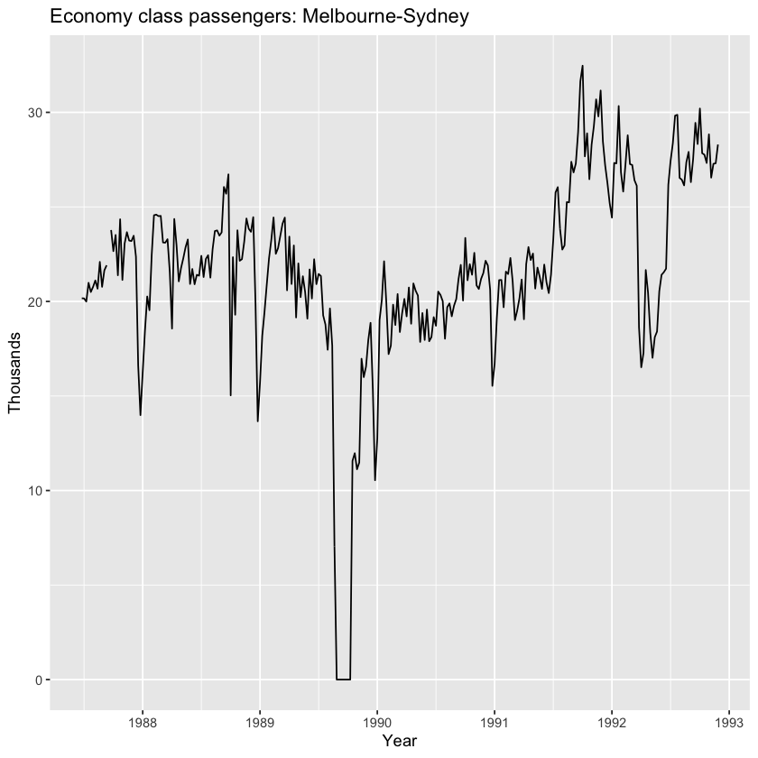


```R
autoplot(a10)+ggtitle("Antldlabetic drug sales")+xlab("Year")+ylab("$million")
```


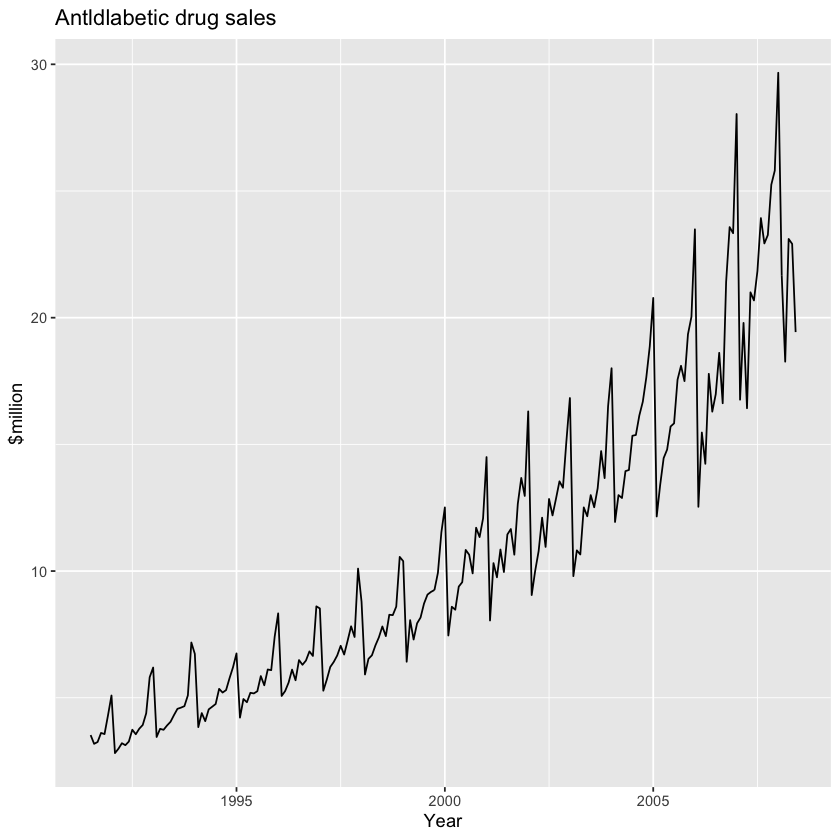


## TS patterns 

**Trend**:A trend exists when there is a long-term increase or decrease in the data.  

**Seasonal**:A seasonal pattern occurs when a time series is affected by seasonal factors such as the time of the year or the day of the week.  

**Cyclic**:A cycle occurs when the data exhibit rises and falls that are **not of a fixed frequency**. These fluctuations are usually due to economic conditions, and are often related to the “business cycle”

## Seasonal plot 


```R
ggseasonplot(a10)+ggtitle("Antldlabetic drug sales")+xlab("Year")+ylab("$million")
```


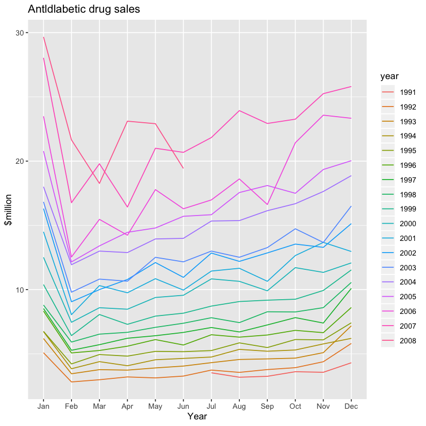


```R
ggseasonplot(a10,,year.labels=TRUE)+ggtitle("Antldlabetic drug sales")+xlab("Year")+ylab("$million")
```


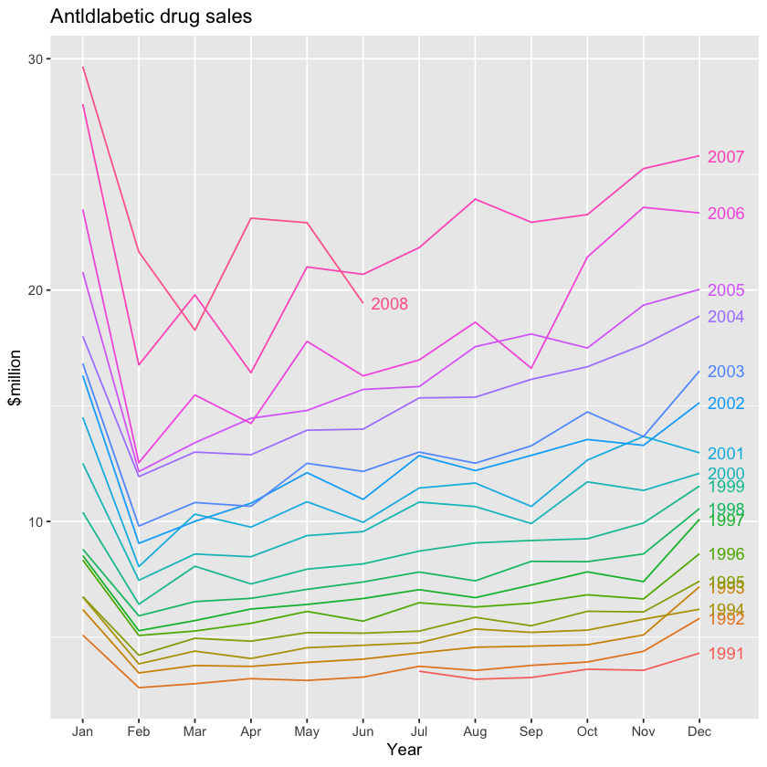


```R
ggseasonplot(a10,year.labels=TRUE,year.labels.left=TRUE)+
ggtitle("Antldlabetic drug sales")+xlab("Year")+ylab("$million")
```


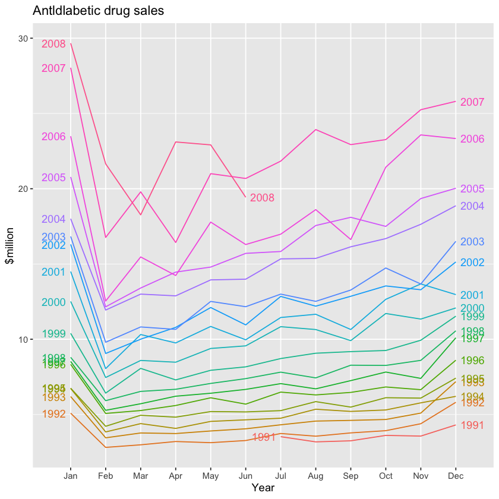


```R
ggseasonplot(a10,polar=TRUE)+ggtitle("Antldlabetic drug sales")+xlab("Year")+ylab("$million")
```


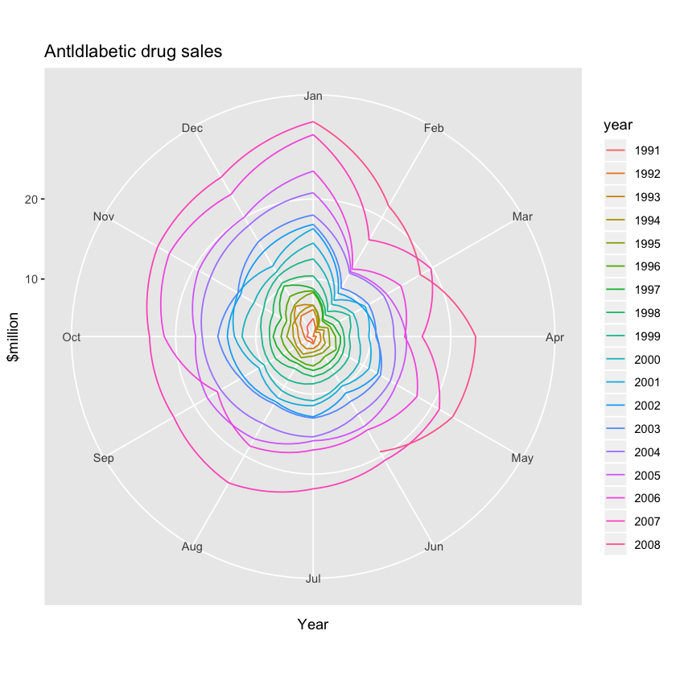


The horizaontal lines (blue lines) represent the means for each month.


```R
ggsubseriesplot(a10)+ggtitle("Seasonal subseries plot:antldlabetic drug sales")+xlab("Year")+ylab("$million")
```


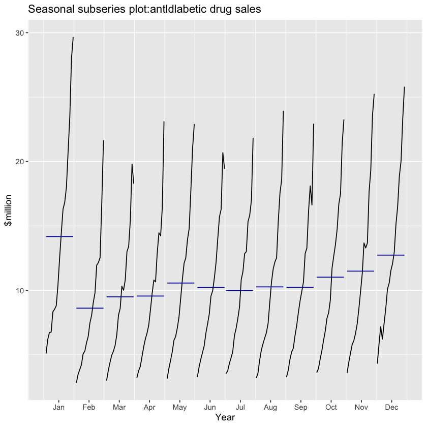


## Scatter Plot

Scatter plot helps us to visualise the relationship between the variables


```R
autoplot(elecdemand[,c("Demand","Temperature")],facets=TRUE)+xlab("Year:2014")+ylab("")+
ggtitle("Half-hourly electricity demand: Victoria, Australia")
```


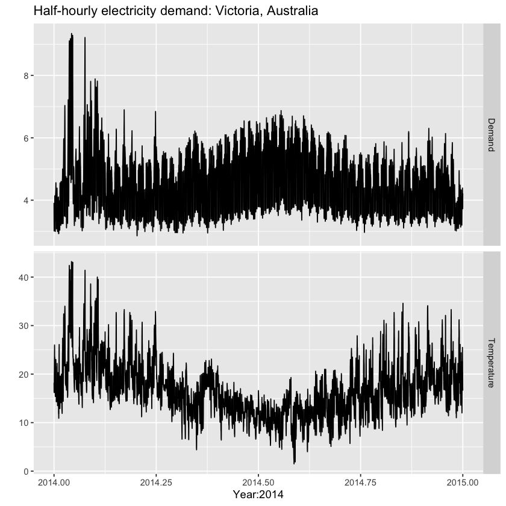


```R
qplot(Temperature,Demand,data=as.data.frame(elecdemand))+ylab("Demand (GW)")+xlab("Temperatue (Celsius)")
```


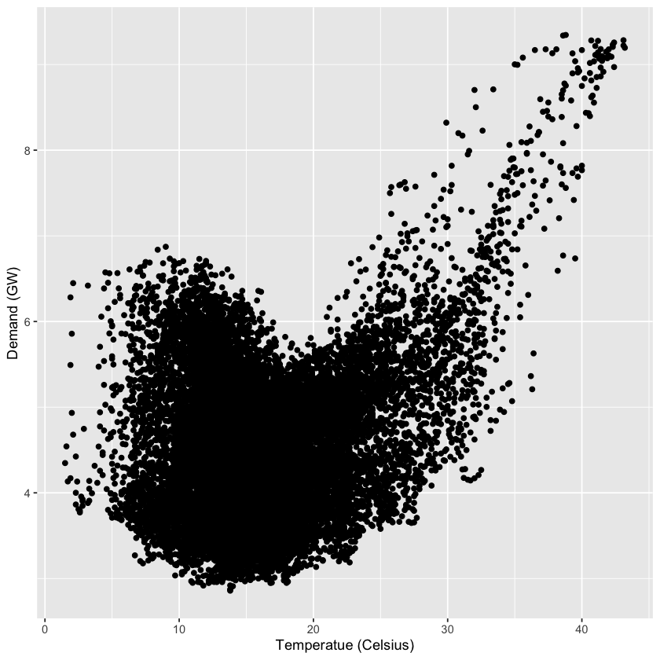


```R
autoplot(visnights[,1:5],facets=TRUE)+ylab("Number of visitor nights each quarter (millions)")
```


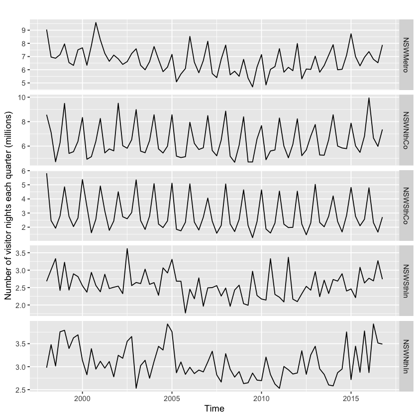


```R
GGally::ggpairs(as.data.frame(visnights[,1:5]))
```


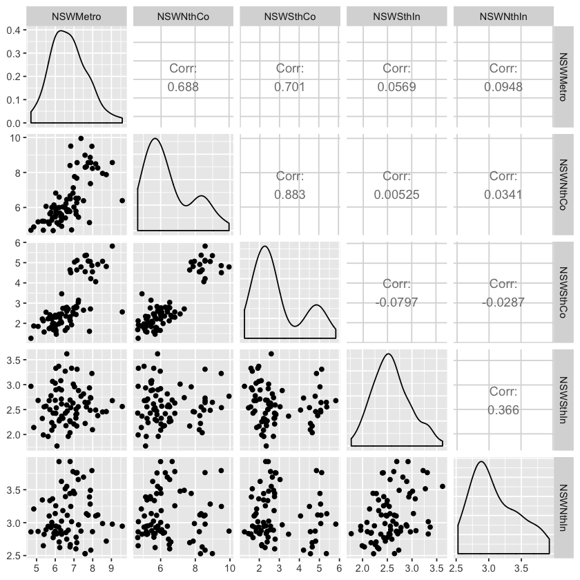


## Lag plots

Each graph shows $$\y_t\$$ plotted against $$\y_{t−k}\$$ for different values of k.


```R
beer2 <- window(ausbeer,start=1992) 
#window: Extract the subset of a 'timeDate' object observed between two time stamps. 
```


```R
beer2
```


<table>
<caption>A Time Series: 19 × 4</caption>
<thead>
	<tr><th></th><th scope=col>Qtr1</th><th scope=col>Qtr2</th><th scope=col>Qtr3</th><th scope=col>Qtr4</th></tr>
</thead>
<tbody>
	<tr><th scope=row>1992</th><td>443</td><td>410</td><td>420</td><td>532</td></tr>
	<tr><th scope=row>1993</th><td>433</td><td>421</td><td>410</td><td>512</td></tr>
	<tr><th scope=row>1994</th><td>449</td><td>381</td><td>423</td><td>531</td></tr>
	<tr><th scope=row>1995</th><td>426</td><td>408</td><td>416</td><td>520</td></tr>
	<tr><th scope=row>1996</th><td>409</td><td>398</td><td>398</td><td>507</td></tr>
	<tr><th scope=row>1997</th><td>432</td><td>398</td><td>406</td><td>526</td></tr>
	<tr><th scope=row>1998</th><td>428</td><td>397</td><td>403</td><td>517</td></tr>
	<tr><th scope=row>1999</th><td>435</td><td>383</td><td>424</td><td>521</td></tr>
	<tr><th scope=row>2000</th><td>421</td><td>402</td><td>414</td><td>500</td></tr>
	<tr><th scope=row>2001</th><td>451</td><td>380</td><td>416</td><td>492</td></tr>
	<tr><th scope=row>2002</th><td>428</td><td>408</td><td>406</td><td>506</td></tr>
	<tr><th scope=row>2003</th><td>435</td><td>380</td><td>421</td><td>490</td></tr>
	<tr><th scope=row>2004</th><td>435</td><td>390</td><td>412</td><td>454</td></tr>
	<tr><th scope=row>2005</th><td>416</td><td>403</td><td>408</td><td>482</td></tr>
	<tr><th scope=row>2006</th><td>438</td><td>386</td><td>405</td><td>491</td></tr>
	<tr><th scope=row>2007</th><td>427</td><td>383</td><td>394</td><td>473</td></tr>
	<tr><th scope=row>2008</th><td>420</td><td>390</td><td>410</td><td>488</td></tr>
	<tr><th scope=row>2009</th><td>415</td><td>398</td><td>419</td><td>488</td></tr>
	<tr><th scope=row>2010</th><td>414</td><td>374</td><td>   </td><td>   </td></tr>
</tbody>
</table>


```R
window(ausbeer,start=1992,end=2000) 
```


<table>
<caption>A Time Series: 9 × 4</caption>
<thead>
	<tr><th></th><th scope=col>Qtr1</th><th scope=col>Qtr2</th><th scope=col>Qtr3</th><th scope=col>Qtr4</th></tr>
</thead>
<tbody>
	<tr><th scope=row>1992</th><td>443</td><td>410</td><td>420</td><td>532</td></tr>
	<tr><th scope=row>1993</th><td>433</td><td>421</td><td>410</td><td>512</td></tr>
	<tr><th scope=row>1994</th><td>449</td><td>381</td><td>423</td><td>531</td></tr>
	<tr><th scope=row>1995</th><td>426</td><td>408</td><td>416</td><td>520</td></tr>
	<tr><th scope=row>1996</th><td>409</td><td>398</td><td>398</td><td>507</td></tr>
	<tr><th scope=row>1997</th><td>432</td><td>398</td><td>406</td><td>526</td></tr>
	<tr><th scope=row>1998</th><td>428</td><td>397</td><td>403</td><td>517</td></tr>
	<tr><th scope=row>1999</th><td>435</td><td>383</td><td>424</td><td>521</td></tr>
	<tr><th scope=row>2000</th><td>421</td><td>   </td><td>   </td><td>   </td></tr>
</tbody>
</table>


```R
gglagplot(beer2) #lag4 and lag8, strongly positive relationship; lag2 and lag6, strongly negative relationship
```


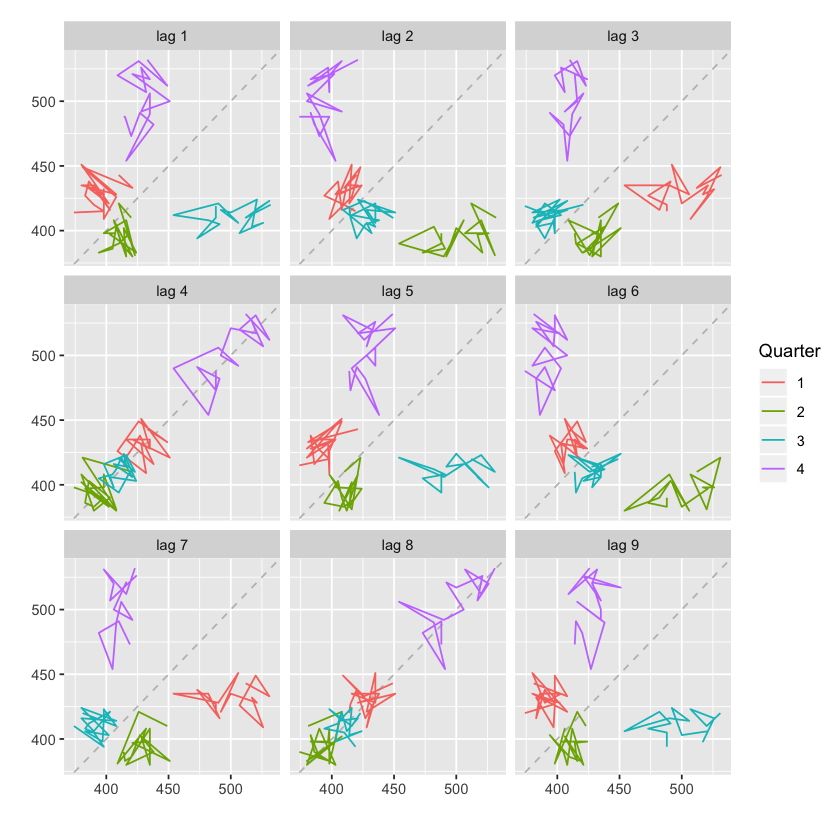


## Autocorrelation


```R
ggAcf(beer2)
#r4 is higher than for the other lags. This is due to the seasonal pattern in the data: 
#the peaks tend to be four quarters apart and the troughs tend to be four quarters apart.
```


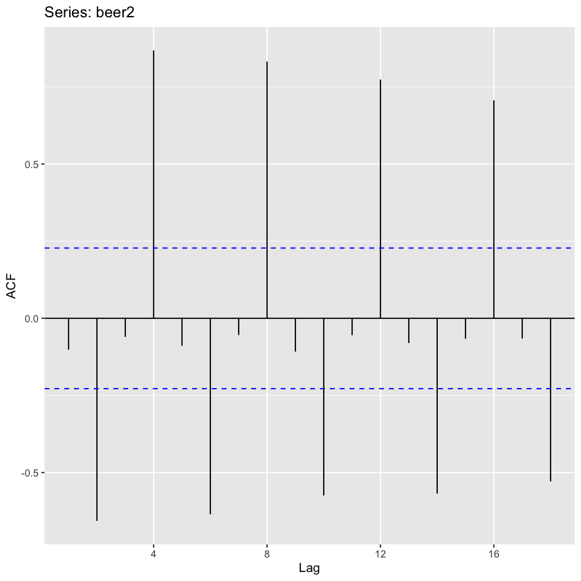


**Trend**: the autocorrelations for small lags tend to be large and positive because observations nearby in time are also nearby in size. So the ACF of trended time series tend to have positive values that slowly decrease as the lags increase.  

**Seasonality**: the autocorrelations will be larger for the seasonal lags (at multiples of the seasonal frequency) than for other lags.   

**Trend+Seasonality**: a combination of above effects


```R
#combine
aelec <- window(elec,start=1980)
autoplot(aelec)+xlab("Year")+ylab("GWh")
```


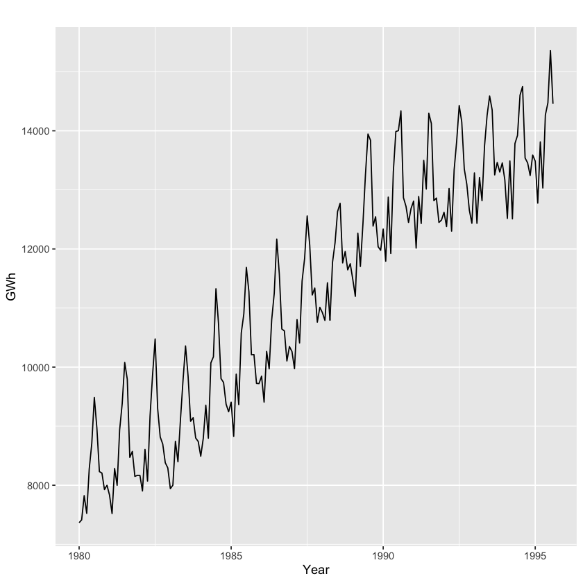


```R
ggAcf(aelec,lag=48)
```


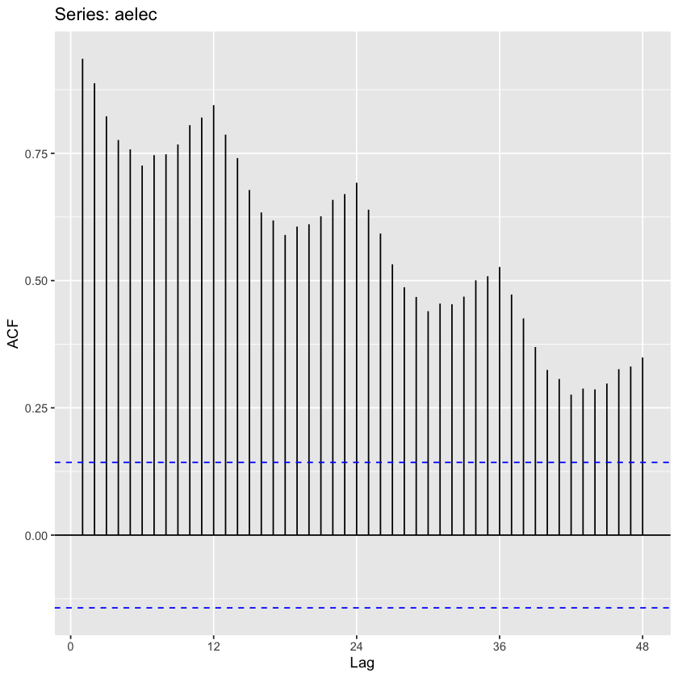


## White noise


```R
set.seed(30)
y <- ts(rnorm(50))
```


```R
y
```


A Time Series:<br><style>
.list-inline {list-style: none; margin:0; padding: 0}
.list-inline>li {display: inline-block}
.list-inline>li:not(:last-child)::after {content: "\00b7"; padding: 0 .5ex}
</style>
<ol class=list-inline><li>-1.28851820062475</li><li>-0.347689405260023</li><li>-0.521628849214455</li><li>1.27347316401659</li><li>1.82452060134868</li><li>-1.51130794100387</li><li>0.110508045739943</li><li>-0.760796227598105</li><li>-0.669897017128139</li><li>0.27451968836576</li><li>-1.02327202024419</li><li>-1.81939790765856</li><li>-0.667789810820964</li><li>-0.0592979926316426</li><li>0.880165914775578</li><li>0.268512916272135</li><li>-0.0195793798812284</li><li>-0.524946972785577</li><li>-1.40933143199095</li><li>-1.83398921416691</li><li>-0.158314294229584</li><li>0.754426571017363</li><li>-0.912129623877029</li><li>0.799931140198325</li><li>1.49055300024804</li><li>-1.09640198989762</li><li>-0.534220686968875</li><li>-1.42120302730805</li><li>-1.24273830226432</li><li>0.231936178179187</li><li>-1.72520249568025</li><li>0.614860698858126</li><li>0.726875140101454</li><li>-0.042190204196379</li><li>0.216001796914866</li><li>1.76973638868275</li><li>0.220350911239156</li><li>0.531478667787331</li><li>2.16970096056706</li><li>-2.93441823798351</li><li>-0.995564634072697</li><li>1.16955321947591</li><li>-0.480039841600269</li><li>-1.66886762541605</li><li>1.13399719429222</li><li>-0.317595831171395</li><li>0.175857990232157</li><li>-0.625509546118603</li><li>-1.63952782104836</li><li>-0.671484417381168</li></ol>


```R
autoplot(y)+ggtitle("White noise")
```


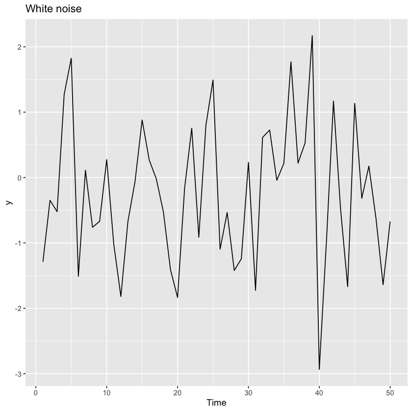


```R
ggAcf(y)
```


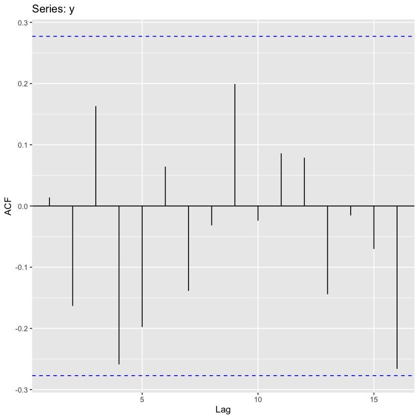


**For white noise series, we expect each autocorrelation to be close to zero. Of course, they will not be exactly equal to zero as there is some random variation. For a white noise series, we expect 95% of the spikes in the ACF to lie within $$\pm{2}\sqrt{T}$$ where T is the length of the time series.**
