# The linear model

## Simple linear model


```R
autoplot(uschange[,c("Consumption","Income")])+xlab("Year")+ylab("% change")+
ggtitle("% changes in personal consumption expenditure and personal income")
```


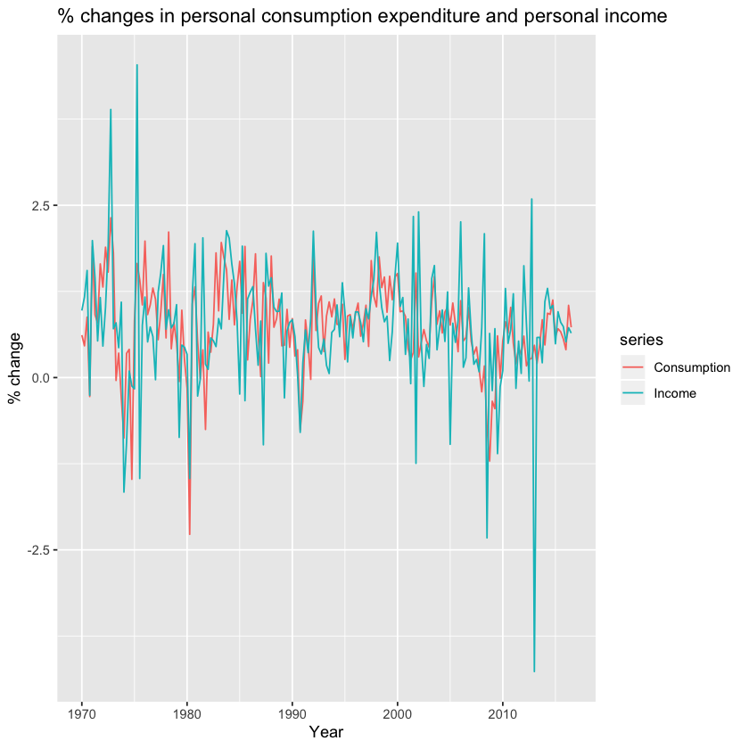


```R
uschange %>% as.data.frame() %>% ggplot(aes(x=Income,y=Consumption))+ylab("Consumption (quarterly % change)")+
xlab("Income (quarterly % change)")+geom_point()+geom_smooth(method="lm",se=FALSE) #standard error
```


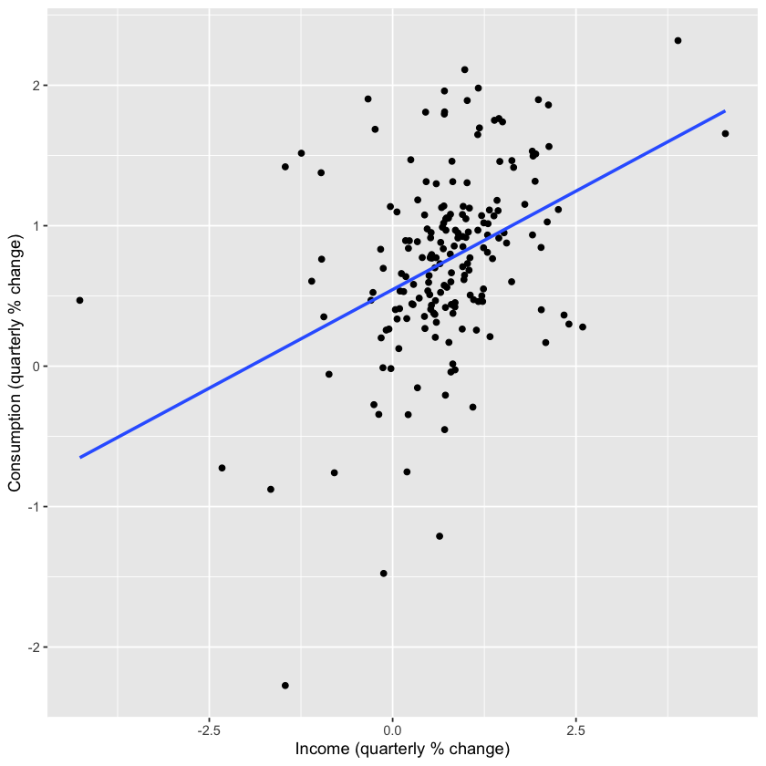


```R
tslm(Consumption~Income,data=uschange)
```


    
    Call:
    tslm(formula = Consumption ~ Income, data = uschange)
    
    Coefficients:
    (Intercept)       Income  
         0.5451       0.2806  


## Multiple linear model


```R
autoplot(uschange[,3:5],facets=T)
```


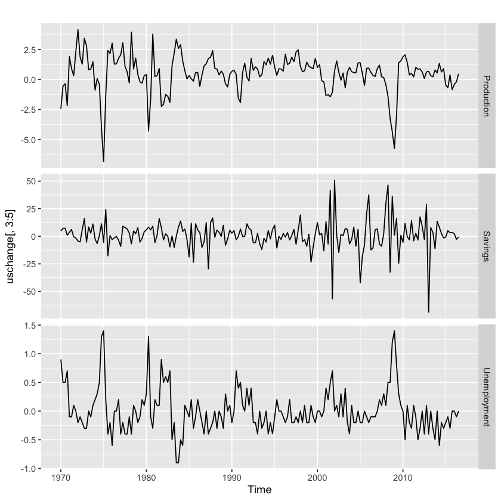


```R
uschange %>% as.data.frame() %>% GGally::ggpairs()
```


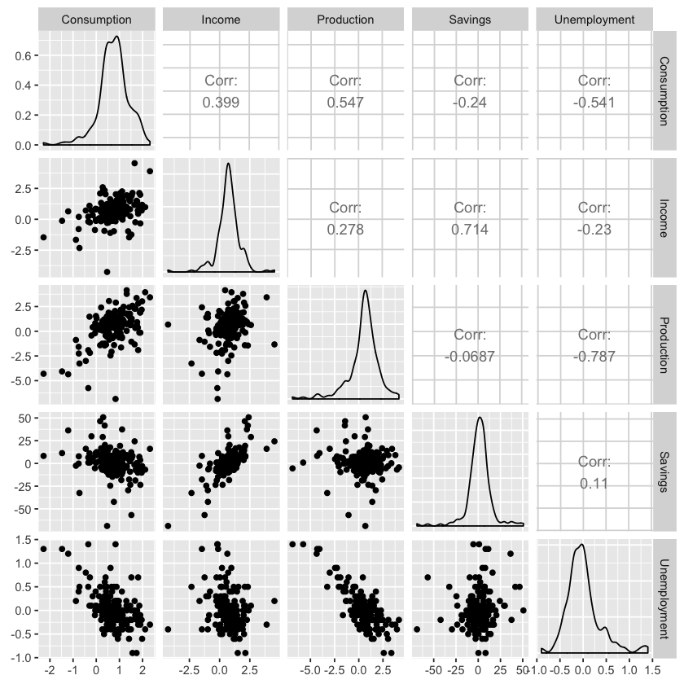


```R
lm_fit <- tslm(Consumption~Income + Production + Unemployment + Savings,data=uschange)
summary(lm_fit)
```


    
    Call:
    tslm(formula = Consumption ~ Income + Production + Unemployment + 
        Savings, data = uschange)
    
    Residuals:
         Min       1Q   Median       3Q      Max 
    -0.88296 -0.17638 -0.03679  0.15251  1.20553 
    
    Coefficients:
                 Estimate Std. Error t value Pr(>|t|)    
    (Intercept)   0.26729    0.03721   7.184 1.68e-11 ***
    Income        0.71449    0.04219  16.934  < 2e-16 ***
    Production    0.04589    0.02588   1.773   0.0778 .  
    Unemployment -0.20477    0.10550  -1.941   0.0538 .  
    Savings      -0.04527    0.00278 -16.287  < 2e-16 ***
    ---
    Signif. codes:  0 ‘***’ 0.001 ‘**’ 0.01 ‘*’ 0.05 ‘.’ 0.1 ‘ ’ 1
    
    Residual standard error: 0.3286 on 182 degrees of freedom
    Multiple R-squared:  0.754,	Adjusted R-squared:  0.7486 
    F-statistic: 139.5 on 4 and 182 DF,  p-value: < 2.2e-16


## Fitting


```R
autoplot(uschange[,"Consumption"],series="Data")+autolayer(fitted(lm_fit),series="Fitted")+xlab("Year")+ylab("")+
guides(colour=guide_legend(title=""))
```


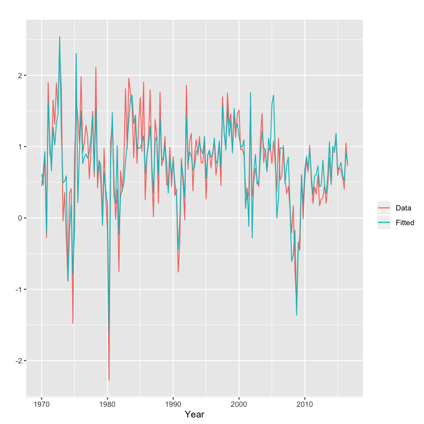


```R
cbind(Data=uschange[,"Consumption"],Fitted=fitted(lm_fit)) %>% as.data.frame() %>% 
ggplot(aes(x=Data,y=Fitted))+geom_point()+ xlab("Data (actual values)") + ylab("Fitted (predicted values)")+
ggtitle("Percent change in US consumption expenditure") + geom_abline()
```


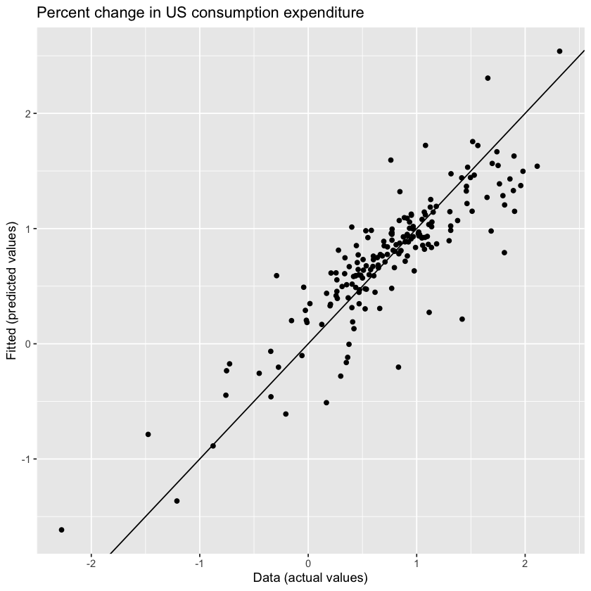


**Goodness-of-fit** : R<sup>2</sup>

<a href="https://www.codecogs.com/eqnedit.php?latex=R^{2}=\frac{\sum&space;(\hat{y}_{t}-\bar{y})^{2}}{\sum(y_{t}-\bar{y}^{2})&space;}" target="_blank"></a>

**Standard error of the regression**

<a href="https://www.codecogs.com/eqnedit.php?latex=\hat{\sigma&space;}_{e}=\sqrt{\frac{1}{T-k-1}\sum_{t=1}^{T}e_{t}^{2}}" target="_blank"></a>

where k is the number of predictors in the model. Notice that we divide by T−k−1 because we have estimated k+1 parameters (the intercept and a coefficient for each predictor variable) in computing the residuals.

# Evaluating the regression model


```R
checkresiduals(lm_fit)
```


    
    	Breusch-Godfrey test for serial correlation of order up to 8
    
    data:  Residuals from Linear regression model
    LM test = 14.874, df = 8, p-value = 0.06163


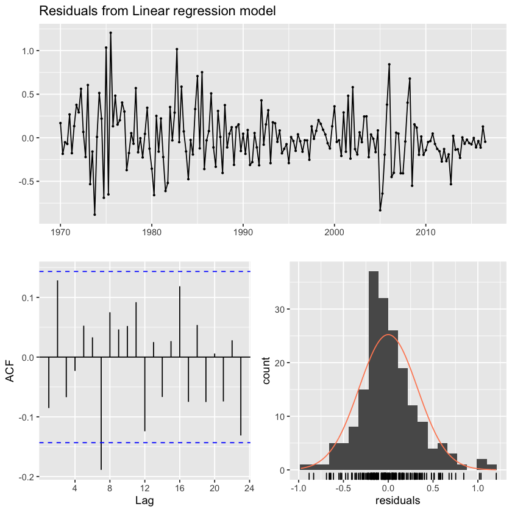


**We would expect the residuals to be randomly scattered without showing any systematic patterns.A simple and quick way to check this is to examine scatterplots of the residuals against each of the predictor variables. If these scatterplots show a pattern, then the relationship may be nonlinear and the model will need to be modified accordingly.**


```R
#residual plots against predictors
df <- data.frame(uschange)
df$Residuals <- as.numeric(residuals(lm_fit))
p1 <- ggplot(df,aes(x=Income,y=Residuals))+geom_point()
p2 <- ggplot(df,aes(x=Production,y=Residuals))+geom_point()
p3 <- ggplot(df,aes(x=Savings,y=Residuals))+geom_point()
p4 <- ggplot(df,aes(x=Unemployment,y=Residuals))+geom_point()
gridExtra::grid.arrange(p1,p2,p3,p4,nrow=2)
```


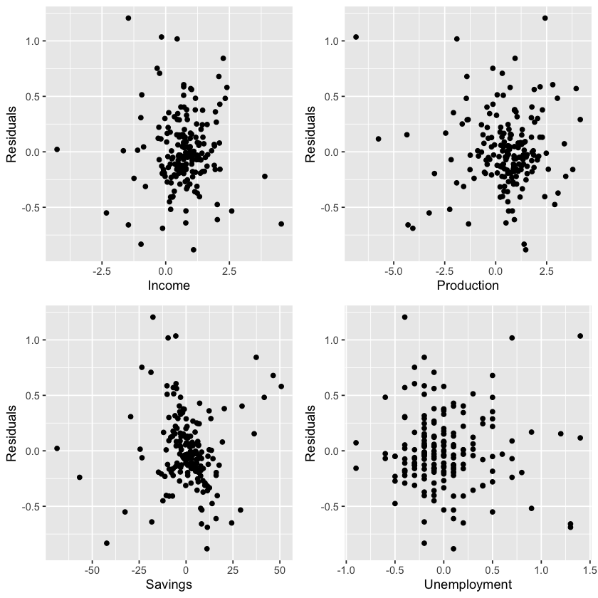


**A plot of the residuals against the fitted values should also show no pattern. If a pattern is observed, there may be “heteroscedasticity” in the errors which means that the variance of the residuals may not be constant. If this problem occurs, a transformation of the forecast variable such as a logarithm or square root may be required**


```R
cbind(Residuals=residuals(lm_fit),Fitted=fitted(lm_fit)) %>% as.data.frame() %>%
ggplot(aes(x=Fitted,y=Residuals))+geom_point()
```


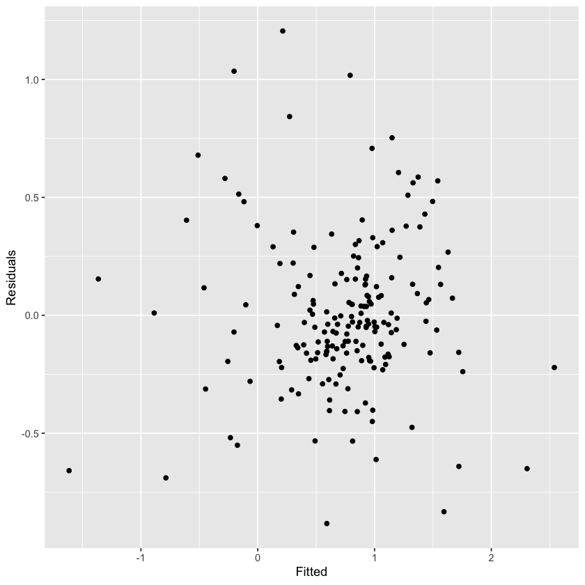


# Some useful predictors

**Trend,**  
**Dummy variables,**  
**Seasonal dummy variables,**  
**Intervention variables**:e.g.competitor activity, advertising expenditure, industrial action  
**Trading days**: RCODE: bizdays() compute the number of trading days,   
**Distributed lags,**  
**Easter**: RCODE: easter(),  
**Fourier series/harmonic regression (sin,cos)**


```R
#example for Seasonal dummy variables
beer2 <- window(ausbeer,start=1992)
autoplot(beer2)+xlab("Year")+ylab("Megalitres")
```


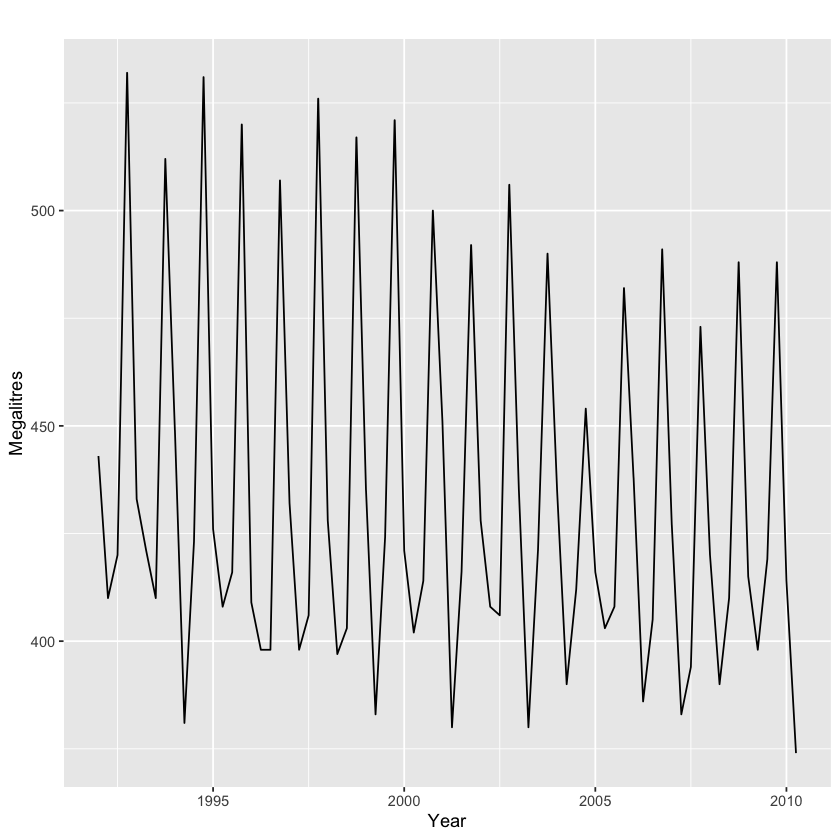


```R
fit.beer <- tslm(beer2~trend+season)
summary(fit.beer)
```


    
    Call:
    tslm(formula = beer2 ~ trend + season)
    
    Residuals:
        Min      1Q  Median      3Q     Max 
    -42.903  -7.599  -0.459   7.991  21.789 
    
    Coefficients:
                 Estimate Std. Error t value Pr(>|t|)    
    (Intercept) 441.80044    3.73353 118.333  < 2e-16 ***
    trend        -0.34027    0.06657  -5.111 2.73e-06 ***
    season2     -34.65973    3.96832  -8.734 9.10e-13 ***
    season3     -17.82164    4.02249  -4.430 3.45e-05 ***
    season4      72.79641    4.02305  18.095  < 2e-16 ***
    ---
    Signif. codes:  0 ‘***’ 0.001 ‘**’ 0.01 ‘*’ 0.05 ‘.’ 0.1 ‘ ’ 1
    
    Residual standard error: 12.23 on 69 degrees of freedom
    Multiple R-squared:  0.9243,	Adjusted R-squared:  0.9199 
    F-statistic: 210.7 on 4 and 69 DF,  p-value: < 2.2e-16


```R
autoplot(beer2,series="Data")+autolayer(fitted(fit.beer),series="Fitted")+xlab("Year")+ylab("Megalitres")+
ggtitle("Quarterly Beer Production")
```


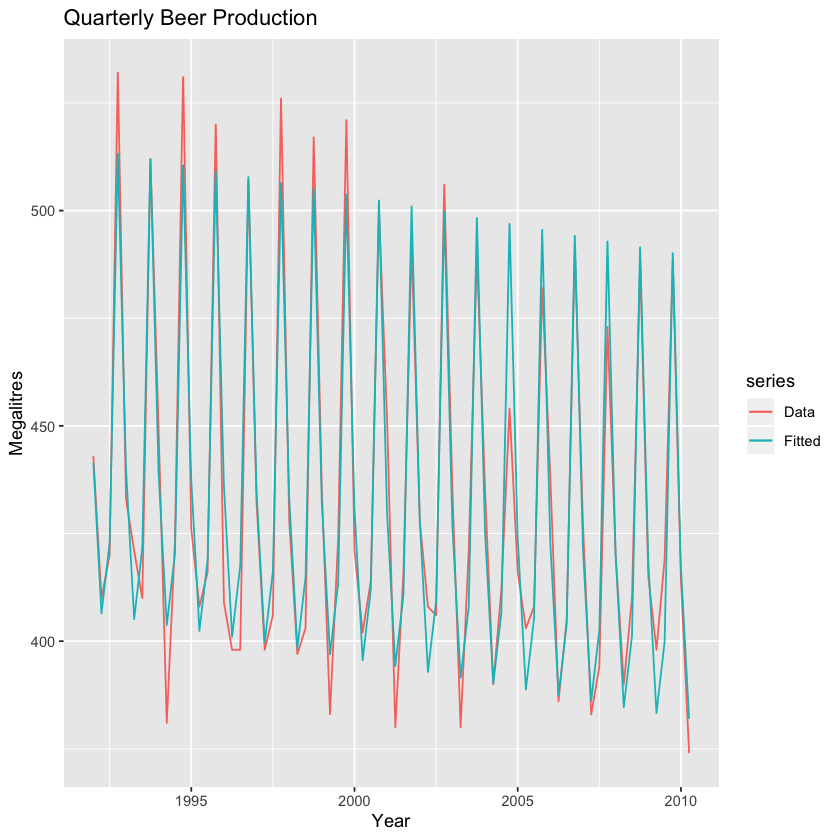


```R
cbind(Data=beer2,Fitted=fitted(fit.beer)) %>% as.data.frame() %>% 
ggplot(aes(x=Data,y=Fitted,color=as.factor(cycle(beer2))))+geom_point()+xlab("Actual values")+ylab("Fitted")+
scale_color_brewer(palette="Dark2",name="Quarter")+ggtitle("Quarterly beer production")+geom_abline()
```


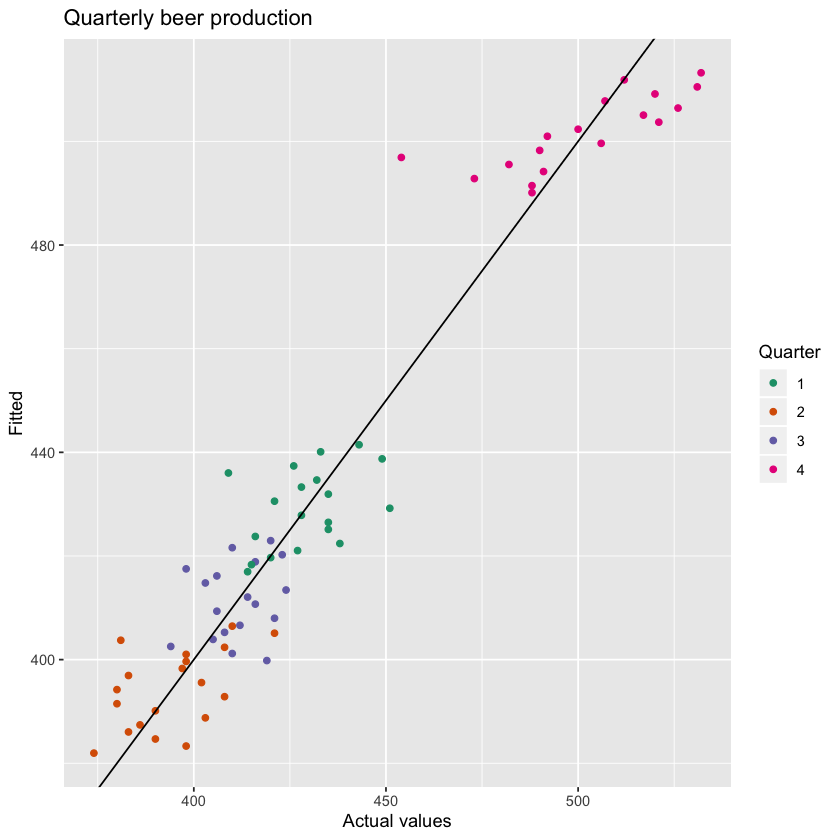


```R
#example for fourier series
fourier.beer <- tslm(beer2~trend+fourier(beer2,K=2))
summary(fourier.beer)
```


    
    Call:
    tslm(formula = beer2 ~ trend + fourier(beer2, K = 2))
    
    Residuals:
        Min      1Q  Median      3Q     Max 
    -42.903  -7.599  -0.459   7.991  21.789 
    
    Coefficients:
                               Estimate Std. Error t value Pr(>|t|)    
    (Intercept)               446.87920    2.87321 155.533  < 2e-16 ***
    trend                      -0.34027    0.06657  -5.111 2.73e-06 ***
    fourier(beer2, K = 2)S1-4   8.91082    2.01125   4.430 3.45e-05 ***
    fourier(beer2, K = 2)C1-4  53.72807    2.01125  26.714  < 2e-16 ***
    fourier(beer2, K = 2)C2-4  13.98958    1.42256   9.834 9.26e-15 ***
    ---
    Signif. codes:  0 ‘***’ 0.001 ‘**’ 0.01 ‘*’ 0.05 ‘.’ 0.1 ‘ ’ 1
    
    Residual standard error: 12.23 on 69 degrees of freedom
    Multiple R-squared:  0.9243,	Adjusted R-squared:  0.9199 
    F-statistic: 210.7 on 4 and 69 DF,  p-value: < 2.2e-16


The first argument to fourier() allows it to identify the seasonal period m and the length of the predictors to return. The second argument K specifies how many pairs of sin and cos terms to include. The maximum allowed is K=m/2 where m is the seasonal period. Because we have used the maximum here, the results are identical to those obtained when using seasonal dummy variables.

# Forecasting with regression


```R
fcast <- forecast(fit.beer)
autoplot(fcast)+xlab("Year")+ylab("megalltres")+ggtitle("Forecasts of beer production using regression")
```


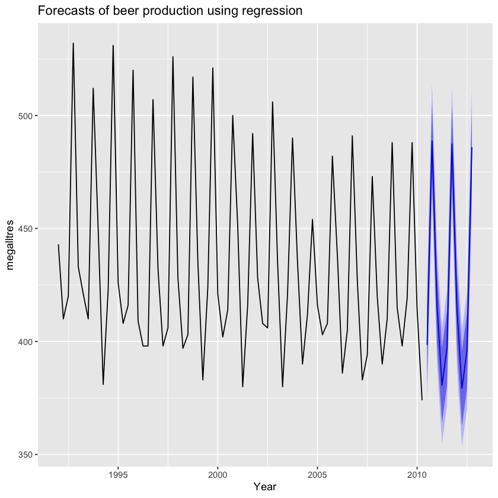


## Scenario based forecasting

 For example, a US policy maker may be interested in comparing the predicted change in consumption when there is a constant growth of 1% and 0.5% respectively for income and savings with no change in the employment rate, versus a respective decline of 1% and 0.5%, for each of the four quarters following the end of the sample. 


```R
fit.consBest <- tslm(Consumption~Income+Savings+Unemployment,data=uschange)
newdata <- data.frame(Income=rep(1,4),Savings=rep(0.5,4),Unemployment=rep(0,4))
fcast.up <- forecast(fit.consBest,newdata=newdata)
fcast.up
```


            Point Forecast     Lo 80    Hi 80     Lo 95    Hi 95
    2016 Q4      0.9885187 0.5619394 1.415098 0.3341497 1.642888
    2017 Q1      0.9885187 0.5619394 1.415098 0.3341497 1.642888
    2017 Q2      0.9885187 0.5619394 1.415098 0.3341497 1.642888
    2017 Q3      0.9885187 0.5619394 1.415098 0.3341497 1.642888


```R
newdata1 <- data.frame(Income=rep(-1,4),Savings=rep(-0.5,4),Unemployment=rep(0,4))
fcast.down <- forecast(fit.consBest,newdata=newdata1)
fcast.down
```


            Point Forecast      Lo 80       Hi 80     Lo 95     Hi 95
    2016 Q4      -0.426485 -0.8615813 0.008611386 -1.093919 0.2409491
    2017 Q1      -0.426485 -0.8615813 0.008611386 -1.093919 0.2409491
    2017 Q2      -0.426485 -0.8615813 0.008611386 -1.093919 0.2409491
    2017 Q3      -0.426485 -0.8615813 0.008611386 -1.093919 0.2409491


```R
autoplot(uschange[,1])+autolayer(fcast.up,series="UP")+autolayer(fcast.down,series="Down")+
ylab("% change in US consumption")+guides(color=guide_legend(title="Scenario"))
```


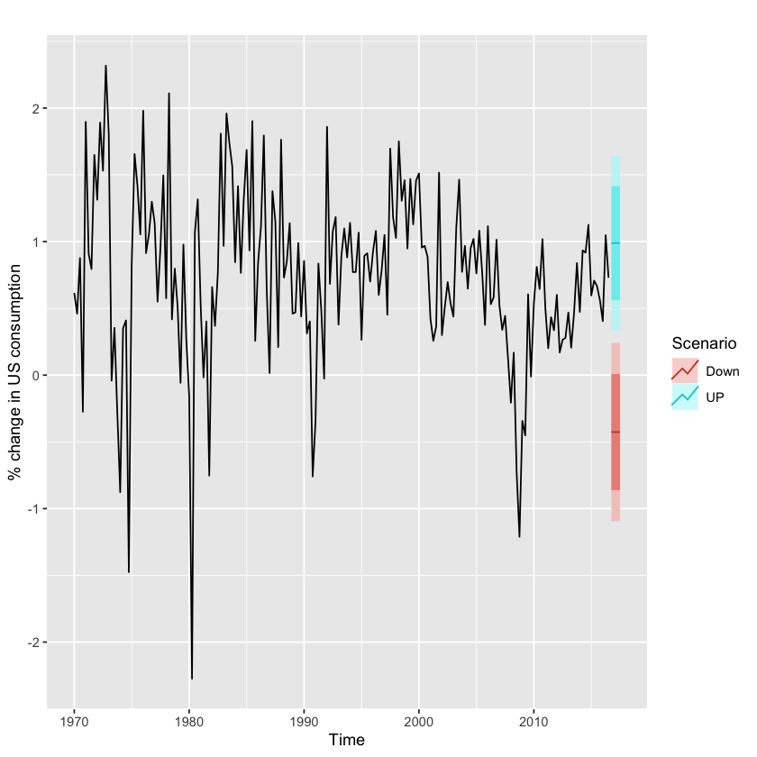


# Nonlinear regression

**Example**


```R
fit.lin <- tslm(marathon~trend)
fcasts.lin <- forecast(fit.lin,h=10)
fit.exp <- tslm(marathon~trend,lambda=0)
fcasts.exp <- forecast(fit.exp,h=10)
```


```R
t <- time(marathon)
t.break1 <- 1940
t.break2 <- 1980
tb1 <- ts(pmax(0,t-t.break1),start=1897)
tb2 <- ts(pmax(0,t-t.break2),start=1897)
fit.pw <- tslm(marathon~t+tb1+tb2)
t.new <- t[length(t)]+seq(10)
tb1.new <- tb1[length(tb1)]+seq(10)
tb2.new <- tb2[length(tb2)]+seq(10)
newdata <- cbind(t=t.new,tb1=tb1.new,tb2=tb2.new) %>% as.data.frame()
fcasts.pw <- forecast(fit.pw,newdata=newdata)
```


```R
fit.spline <- tslm(marathon~t+I(t^2)+I(t^3)+I(tb1^3)+I(tb2^3))
fcasts.spl <- forecast(fit.spline, newdata = newdata)
```


```R
autoplot(marathon)+autolayer(fitted(fit.lin),series="Linear")+
autolayer(fitted(fit.exp),series="Exponential")+
autolayer(fitted(fit.pw),series="Piecewise")+
autolayer(fitted(fit.spline),series="Cubic spline")+
autolayer(fcasts.lin,series="Linear",PI=F)+
autolayer(fcasts.exp,series="Exponential",PI=F)+
autolayer(fcasts.pw,series="Piecewise")+
autolayer(fcasts.spl,series="Cubic spline",PI=F)+
xlab("Year") + ylab("Winning times in minutes") +ggtitle("Boston Marathon") +
guides(colour = guide_legend(title = " "))
```


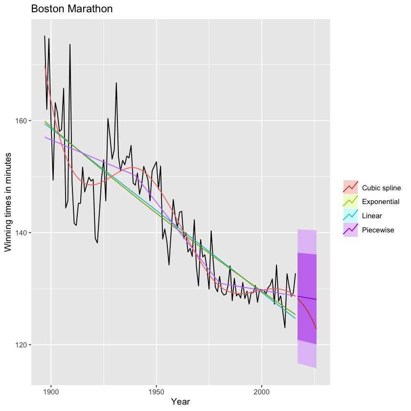


```R
# we have used the splinef() function to produce the cubic spline forecasts. This uses many more knots than we used 
# above, but the coefficients are constrained to prevent over-fitting, and the curve is linear at both ends.
# This has the added advantage that knot selection is not subjective. 
marathon %>% splinef(lambda=0) %>% autoplot()
```


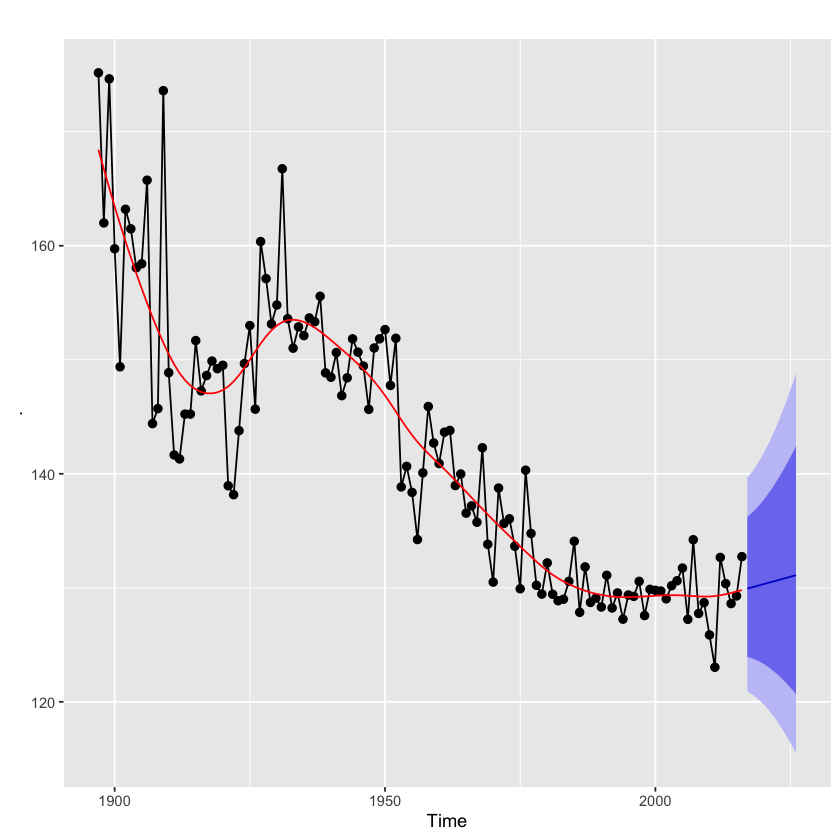

