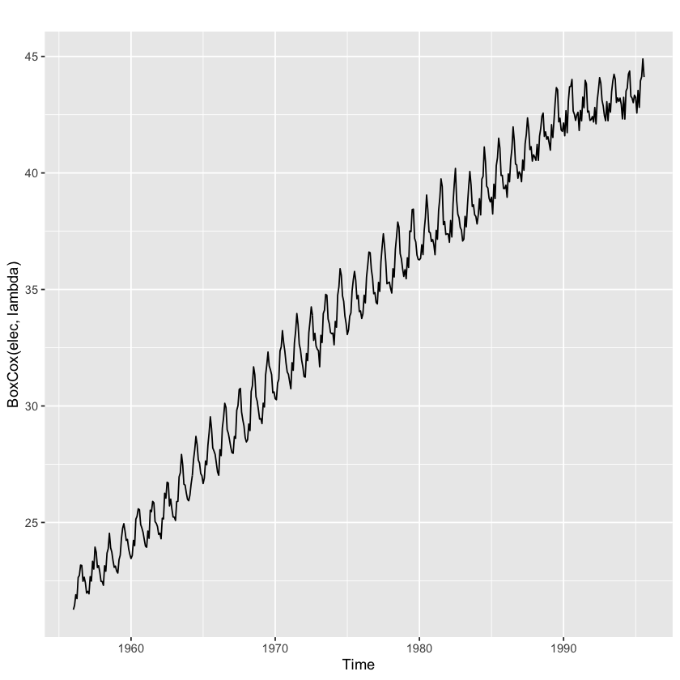

# Some simple forecasting methods

## Average method

The forecasts of all future values are equal to the average (or “mean”) of the historical data:

<a href="https://www.codecogs.com/eqnedit.php?latex=\hat{y}_{T&plus;h|T}=\bar{y}=(y_{1}&plus;y_{2}&plus;\cdot&space;\cdot&space;\cdot&space;&plus;y_{T})/T" target="_blank"></a>

Rcode: **meanf(y, h)**  
    y contains the time series  
    h is the forecast horizon

## Naive method/random walk forecast

Set all forecasts to be the value of the last observation:

<a href="https://www.codecogs.com/eqnedit.php?latex=\hat{y}_{T&plus;h|T}=y_{T}" target="_blank"></a>

Rcode:  
**naive(y, h)**  
**rwf(y, h)** - Equivalent alternative

## Seasonal naive method

Set each forecast to be equal to the last observed value from the same season of the year:

<a href="https://www.codecogs.com/eqnedit.php?latex=\hat{y}_{T&plus;h|T}=y_{T&plus;h-m(k&plus;1)}" target="_blank"></a>

where m= the seasonal period, and k is the integer part of (h−1)/m (i.e., the number of complete years in the forecast period prior to time T+h).

Rcode: **snaive(y, h)**

## Drift method

A variation on the naive method is to allow the forecasts to increase or decrease over time, where the amount of change over time (called the drift) is set to be the average change seen in the historical data:

<a href="https://www.codecogs.com/eqnedit.php?latex=\hat{y}_{T&plus;h|T}=y_{T}&plus;\frac{h}{T-1}\sum_{t=2}^{T}(y_{t}-y_{t-1})=y_{T}&plus;h(\frac{y_{T}-y_{1}}{T-1})" target="_blank"></a>

Rcode: **rwf(y,h,drift=TRUE)**

## Example


```R
library(fpp2)
beer2 <- window(ausbeer,start=1992,end=c(2007,4))
```


```R
autoplot(beer2)
```


```R
autoplot(beer2)+autolayer(meanf(beer2,h=11),series="Mean",PI=FALSE)+
autolayer(rwf(beer2,h=11),series="Naive",PI=FALSE)+
autolayer(snaive(beer2,h=11),series="Seasonal naive",PI=FALSE)+
ggtitle("Forecasts for quarterly beer production")+
xlab("Year")+ylab("Megalitres")+
guides(colour=guide_legend(title="Forecast"))
```


```R
autoplot(goog200)
```


```R
autoplot(goog200)+autolayer(meanf(goog200,h=48),series="Mean",PI=FALSE)+
autolayer(naive(goog200,h=48),series="Naive",PI=FALSE)+
autolayer(rwf(goog200,h=48,drift=TRUE),series="Drift",PI=FALSE)+
ggtitle("Google stock (daily ending 6 Dec 2013)")+xlab("Day")+ylab("Closing Price (US$)")+
guides(colour=guide_legend(title="Forecast"))
```


# Transformation and Adjustments 

## Calendar adjustments

Some of the variation seen in seasonal data may be due to simple calendar effects. 

Rcode: monthdays() will be useful - compute the number of days in each month or quarter


```R
#example
df <- cbind(Monthly=milk,DailyAverage=milk/monthdays(milk))
#cbind add columns; rbind add rows
```


```R
autoplot(df,facet=TRUE)+xlab("Year")+ylab("Pounds")+ggtitle("Milk production per cow")
```


```R
milk
```


<table>
<caption>A Time Series: 14 × 12</caption>
<thead>
	<tr><th></th><th scope=col>Jan</th><th scope=col>Feb</th><th scope=col>Mar</th><th scope=col>Apr</th><th scope=col>May</th><th scope=col>Jun</th><th scope=col>Jul</th><th scope=col>Aug</th><th scope=col>Sep</th><th scope=col>Oct</th><th scope=col>Nov</th><th scope=col>Dec</th></tr>
</thead>
<tbody>
	<tr><th scope=row>1</th><td>589</td><td>561</td><td>640</td><td>656</td><td>727</td><td>697</td><td>640</td><td>599</td><td>568</td><td>577</td><td>553</td><td>582</td></tr>
	<tr><th scope=row>2</th><td>600</td><td>566</td><td>653</td><td>673</td><td>742</td><td>716</td><td>660</td><td>617</td><td>583</td><td>587</td><td>565</td><td>598</td></tr>
	<tr><th scope=row>3</th><td>628</td><td>618</td><td>688</td><td>705</td><td>770</td><td>736</td><td>678</td><td>639</td><td>604</td><td>611</td><td>594</td><td>634</td></tr>
	<tr><th scope=row>4</th><td>658</td><td>622</td><td>709</td><td>722</td><td>782</td><td>756</td><td>702</td><td>653</td><td>615</td><td>621</td><td>602</td><td>635</td></tr>
	<tr><th scope=row>5</th><td>677</td><td>635</td><td>736</td><td>755</td><td>811</td><td>798</td><td>735</td><td>697</td><td>661</td><td>667</td><td>645</td><td>688</td></tr>
	<tr><th scope=row>6</th><td>713</td><td>667</td><td>762</td><td>784</td><td>837</td><td>817</td><td>767</td><td>722</td><td>681</td><td>687</td><td>660</td><td>698</td></tr>
	<tr><th scope=row>7</th><td>717</td><td>696</td><td>775</td><td>796</td><td>858</td><td>826</td><td>783</td><td>740</td><td>701</td><td>706</td><td>677</td><td>711</td></tr>
	<tr><th scope=row>8</th><td>734</td><td>690</td><td>785</td><td>805</td><td>871</td><td>845</td><td>801</td><td>764</td><td>725</td><td>723</td><td>690</td><td>734</td></tr>
	<tr><th scope=row>9</th><td>750</td><td>707</td><td>807</td><td>824</td><td>886</td><td>859</td><td>819</td><td>783</td><td>740</td><td>747</td><td>711</td><td>751</td></tr>
	<tr><th scope=row>10</th><td>804</td><td>756</td><td>860</td><td>878</td><td>942</td><td>913</td><td>869</td><td>834</td><td>790</td><td>800</td><td>763</td><td>800</td></tr>
	<tr><th scope=row>11</th><td>826</td><td>799</td><td>890</td><td>900</td><td>961</td><td>935</td><td>894</td><td>855</td><td>809</td><td>810</td><td>766</td><td>805</td></tr>
	<tr><th scope=row>12</th><td>821</td><td>773</td><td>883</td><td>898</td><td>957</td><td>924</td><td>881</td><td>837</td><td>784</td><td>791</td><td>760</td><td>802</td></tr>
	<tr><th scope=row>13</th><td>828</td><td>778</td><td>889</td><td>902</td><td>969</td><td>947</td><td>908</td><td>867</td><td>815</td><td>812</td><td>773</td><td>813</td></tr>
	<tr><th scope=row>14</th><td>834</td><td>782</td><td>892</td><td>903</td><td>966</td><td>937</td><td>896</td><td>858</td><td>817</td><td>827</td><td>797</td><td>843</td></tr>
</tbody>
</table>


```R
milk/monthdays(milk)
```


<table>
<caption>A Time Series: 14 × 12</caption>
<thead>
	<tr><th></th><th scope=col>Jan</th><th scope=col>Feb</th><th scope=col>Mar</th><th scope=col>Apr</th><th scope=col>May</th><th scope=col>Jun</th><th scope=col>Jul</th><th scope=col>Aug</th><th scope=col>Sep</th><th scope=col>Oct</th><th scope=col>Nov</th><th scope=col>Dec</th></tr>
</thead>
<tbody>
	<tr><th scope=row>1</th><td>19.00000</td><td>20.03571</td><td>20.64516</td><td>21.86667</td><td>23.45161</td><td>23.23333</td><td>20.64516</td><td>19.32258</td><td>18.93333</td><td>18.61290</td><td>18.43333</td><td>18.77419</td></tr>
	<tr><th scope=row>2</th><td>19.35484</td><td>20.21429</td><td>21.06452</td><td>22.43333</td><td>23.93548</td><td>23.86667</td><td>21.29032</td><td>19.90323</td><td>19.43333</td><td>18.93548</td><td>18.83333</td><td>19.29032</td></tr>
	<tr><th scope=row>3</th><td>20.25806</td><td>22.07143</td><td>22.19355</td><td>23.50000</td><td>24.83871</td><td>24.53333</td><td>21.87097</td><td>20.61290</td><td>20.13333</td><td>19.70968</td><td>19.80000</td><td>20.45161</td></tr>
	<tr><th scope=row>4</th><td>21.22581</td><td>21.44828</td><td>22.87097</td><td>24.06667</td><td>25.22581</td><td>25.20000</td><td>22.64516</td><td>21.06452</td><td>20.50000</td><td>20.03226</td><td>20.06667</td><td>20.48387</td></tr>
	<tr><th scope=row>5</th><td>21.83871</td><td>22.67857</td><td>23.74194</td><td>25.16667</td><td>26.16129</td><td>26.60000</td><td>23.70968</td><td>22.48387</td><td>22.03333</td><td>21.51613</td><td>21.50000</td><td>22.19355</td></tr>
	<tr><th scope=row>6</th><td>23.00000</td><td>23.82143</td><td>24.58065</td><td>26.13333</td><td>27.00000</td><td>27.23333</td><td>24.74194</td><td>23.29032</td><td>22.70000</td><td>22.16129</td><td>22.00000</td><td>22.51613</td></tr>
	<tr><th scope=row>7</th><td>23.12903</td><td>24.85714</td><td>25.00000</td><td>26.53333</td><td>27.67742</td><td>27.53333</td><td>25.25806</td><td>23.87097</td><td>23.36667</td><td>22.77419</td><td>22.56667</td><td>22.93548</td></tr>
	<tr><th scope=row>8</th><td>23.67742</td><td>23.79310</td><td>25.32258</td><td>26.83333</td><td>28.09677</td><td>28.16667</td><td>25.83871</td><td>24.64516</td><td>24.16667</td><td>23.32258</td><td>23.00000</td><td>23.67742</td></tr>
	<tr><th scope=row>9</th><td>24.19355</td><td>25.25000</td><td>26.03226</td><td>27.46667</td><td>28.58065</td><td>28.63333</td><td>26.41935</td><td>25.25806</td><td>24.66667</td><td>24.09677</td><td>23.70000</td><td>24.22581</td></tr>
	<tr><th scope=row>10</th><td>25.93548</td><td>27.00000</td><td>27.74194</td><td>29.26667</td><td>30.38710</td><td>30.43333</td><td>28.03226</td><td>26.90323</td><td>26.33333</td><td>25.80645</td><td>25.43333</td><td>25.80645</td></tr>
	<tr><th scope=row>11</th><td>26.64516</td><td>28.53571</td><td>28.70968</td><td>30.00000</td><td>31.00000</td><td>31.16667</td><td>28.83871</td><td>27.58065</td><td>26.96667</td><td>26.12903</td><td>25.53333</td><td>25.96774</td></tr>
	<tr><th scope=row>12</th><td>26.48387</td><td>26.65517</td><td>28.48387</td><td>29.93333</td><td>30.87097</td><td>30.80000</td><td>28.41935</td><td>27.00000</td><td>26.13333</td><td>25.51613</td><td>25.33333</td><td>25.87097</td></tr>
	<tr><th scope=row>13</th><td>26.70968</td><td>27.78571</td><td>28.67742</td><td>30.06667</td><td>31.25806</td><td>31.56667</td><td>29.29032</td><td>27.96774</td><td>27.16667</td><td>26.19355</td><td>25.76667</td><td>26.22581</td></tr>
	<tr><th scope=row>14</th><td>26.90323</td><td>27.92857</td><td>28.77419</td><td>30.10000</td><td>31.16129</td><td>31.23333</td><td>28.90323</td><td>27.67742</td><td>27.23333</td><td>26.67742</td><td>26.56667</td><td>27.19355</td></tr>
</tbody>
</table>


```R
df
```


<table>
<caption>A Time Series: 168 × 2</caption>
<thead>
	<tr><th></th><th scope=col>Monthly</th><th scope=col>DailyAverage</th></tr>
</thead>
<tbody>
	<tr><th scope=row>Jan  1</th><td>589</td><td>19.00000</td></tr>
	<tr><th scope=row>Feb  1</th><td>561</td><td>20.03571</td></tr>
	<tr><th scope=row>Mar  1</th><td>640</td><td>20.64516</td></tr>
	<tr><th scope=row>Apr  1</th><td>656</td><td>21.86667</td></tr>
	<tr><th scope=row>May  1</th><td>727</td><td>23.45161</td></tr>
	<tr><th scope=row>Jun  1</th><td>697</td><td>23.23333</td></tr>
	<tr><th scope=row>Jul  1</th><td>640</td><td>20.64516</td></tr>
	<tr><th scope=row>Aug  1</th><td>599</td><td>19.32258</td></tr>
	<tr><th scope=row>Sep  1</th><td>568</td><td>18.93333</td></tr>
	<tr><th scope=row>Oct  1</th><td>577</td><td>18.61290</td></tr>
	<tr><th scope=row>Nov  1</th><td>553</td><td>18.43333</td></tr>
	<tr><th scope=row>Dec  1</th><td>582</td><td>18.77419</td></tr>
	<tr><th scope=row>Jan  2</th><td>600</td><td>19.35484</td></tr>
	<tr><th scope=row>Feb  2</th><td>566</td><td>20.21429</td></tr>
	<tr><th scope=row>Mar  2</th><td>653</td><td>21.06452</td></tr>
	<tr><th scope=row>Apr  2</th><td>673</td><td>22.43333</td></tr>
	<tr><th scope=row>May  2</th><td>742</td><td>23.93548</td></tr>
	<tr><th scope=row>Jun  2</th><td>716</td><td>23.86667</td></tr>
	<tr><th scope=row>Jul  2</th><td>660</td><td>21.29032</td></tr>
	<tr><th scope=row>Aug  2</th><td>617</td><td>19.90323</td></tr>
	<tr><th scope=row>Sep  2</th><td>583</td><td>19.43333</td></tr>
	<tr><th scope=row>Oct  2</th><td>587</td><td>18.93548</td></tr>
	<tr><th scope=row>Nov  2</th><td>565</td><td>18.83333</td></tr>
	<tr><th scope=row>Dec  2</th><td>598</td><td>19.29032</td></tr>
	<tr><th scope=row>Jan  3</th><td>628</td><td>20.25806</td></tr>
	<tr><th scope=row>Feb  3</th><td>618</td><td>22.07143</td></tr>
	<tr><th scope=row>Mar  3</th><td>688</td><td>22.19355</td></tr>
	<tr><th scope=row>Apr  3</th><td>705</td><td>23.50000</td></tr>
	<tr><th scope=row>May  3</th><td>770</td><td>24.83871</td></tr>
	<tr><th scope=row>Jun  3</th><td>736</td><td>24.53333</td></tr>
	<tr><th scope=row>Jul  3</th><td>678</td><td>21.87097</td></tr>
	<tr><th scope=row>Aug  3</th><td>639</td><td>20.61290</td></tr>
	<tr><th scope=row>Sep  3</th><td>604</td><td>20.13333</td></tr>
	<tr><th scope=row>Oct  3</th><td>611</td><td>19.70968</td></tr>
	<tr><th scope=row>Nov  3</th><td>594</td><td>19.80000</td></tr>
	<tr><th scope=row>Dec  3</th><td>634</td><td>20.45161</td></tr>
	<tr><th scope=row>Jan  4</th><td>658</td><td>21.22581</td></tr>
	<tr><th scope=row>Feb  4</th><td>622</td><td>21.44828</td></tr>
	<tr><th scope=row>Mar  4</th><td>709</td><td>22.87097</td></tr>
	<tr><th scope=row>Apr  4</th><td>722</td><td>24.06667</td></tr>
	<tr><th scope=row>May  4</th><td>782</td><td>25.22581</td></tr>
	<tr><th scope=row>Jun  4</th><td>756</td><td>25.20000</td></tr>
	<tr><th scope=row>Jul  4</th><td>702</td><td>22.64516</td></tr>
	<tr><th scope=row>Aug  4</th><td>653</td><td>21.06452</td></tr>
	<tr><th scope=row>Sep  4</th><td>615</td><td>20.50000</td></tr>
	<tr><th scope=row>Oct  4</th><td>621</td><td>20.03226</td></tr>
	<tr><th scope=row>Nov  4</th><td>602</td><td>20.06667</td></tr>
	<tr><th scope=row>Dec  4</th><td>635</td><td>20.48387</td></tr>
	<tr><th scope=row>Jan  5</th><td>677</td><td>21.83871</td></tr>
	<tr><th scope=row>Feb  5</th><td>635</td><td>22.67857</td></tr>
	<tr><th scope=row>Mar  5</th><td>736</td><td>23.74194</td></tr>
	<tr><th scope=row>Apr  5</th><td>755</td><td>25.16667</td></tr>
	<tr><th scope=row>May  5</th><td>811</td><td>26.16129</td></tr>
	<tr><th scope=row>Jun  5</th><td>798</td><td>26.60000</td></tr>
	<tr><th scope=row>Jul  5</th><td>735</td><td>23.70968</td></tr>
	<tr><th scope=row>Aug  5</th><td>697</td><td>22.48387</td></tr>
	<tr><th scope=row>Sep  5</th><td>661</td><td>22.03333</td></tr>
	<tr><th scope=row>Oct  5</th><td>667</td><td>21.51613</td></tr>
	<tr><th scope=row>Nov  5</th><td>645</td><td>21.50000</td></tr>
	<tr><th scope=row>Dec  5</th><td>688</td><td>22.19355</td></tr>
	<tr><th scope=row>Jan  6</th><td>713</td><td>23.00000</td></tr>
	<tr><th scope=row>Feb  6</th><td>667</td><td>23.82143</td></tr>
	<tr><th scope=row>Mar  6</th><td>762</td><td>24.58065</td></tr>
	<tr><th scope=row>Apr  6</th><td>784</td><td>26.13333</td></tr>
	<tr><th scope=row>May  6</th><td>837</td><td>27.00000</td></tr>
	<tr><th scope=row>Jun  6</th><td>817</td><td>27.23333</td></tr>
	<tr><th scope=row>Jul  6</th><td>767</td><td>24.74194</td></tr>
	<tr><th scope=row>Aug  6</th><td>722</td><td>23.29032</td></tr>
	<tr><th scope=row>Sep  6</th><td>681</td><td>22.70000</td></tr>
	<tr><th scope=row>Oct  6</th><td>687</td><td>22.16129</td></tr>
	<tr><th scope=row>Nov  6</th><td>660</td><td>22.00000</td></tr>
	<tr><th scope=row>Dec  6</th><td>698</td><td>22.51613</td></tr>
	<tr><th scope=row>Jan  7</th><td>717</td><td>23.12903</td></tr>
	<tr><th scope=row>Feb  7</th><td>696</td><td>24.85714</td></tr>
	<tr><th scope=row>Mar  7</th><td>775</td><td>25.00000</td></tr>
	<tr><th scope=row>Apr  7</th><td>796</td><td>26.53333</td></tr>
	<tr><th scope=row>May  7</th><td>858</td><td>27.67742</td></tr>
	<tr><th scope=row>Jun  7</th><td>826</td><td>27.53333</td></tr>
	<tr><th scope=row>Jul  7</th><td>783</td><td>25.25806</td></tr>
	<tr><th scope=row>Aug  7</th><td>740</td><td>23.87097</td></tr>
	<tr><th scope=row>Sep  7</th><td>701</td><td>23.36667</td></tr>
	<tr><th scope=row>Oct  7</th><td>706</td><td>22.77419</td></tr>
	<tr><th scope=row>Nov  7</th><td>677</td><td>22.56667</td></tr>
	<tr><th scope=row>Dec  7</th><td>711</td><td>22.93548</td></tr>
	<tr><th scope=row>Jan  8</th><td>734</td><td>23.67742</td></tr>
	<tr><th scope=row>Feb  8</th><td>690</td><td>23.79310</td></tr>
	<tr><th scope=row>Mar  8</th><td>785</td><td>25.32258</td></tr>
	<tr><th scope=row>Apr  8</th><td>805</td><td>26.83333</td></tr>
	<tr><th scope=row>May  8</th><td>871</td><td>28.09677</td></tr>
	<tr><th scope=row>Jun  8</th><td>845</td><td>28.16667</td></tr>
	<tr><th scope=row>Jul  8</th><td>801</td><td>25.83871</td></tr>
	<tr><th scope=row>Aug  8</th><td>764</td><td>24.64516</td></tr>
	<tr><th scope=row>Sep  8</th><td>725</td><td>24.16667</td></tr>
	<tr><th scope=row>Oct  8</th><td>723</td><td>23.32258</td></tr>
	<tr><th scope=row>Nov  8</th><td>690</td><td>23.00000</td></tr>
	<tr><th scope=row>Dec  8</th><td>734</td><td>23.67742</td></tr>
	<tr><th scope=row>Jan  9</th><td>750</td><td>24.19355</td></tr>
	<tr><th scope=row>Feb  9</th><td>707</td><td>25.25000</td></tr>
	<tr><th scope=row>Mar  9</th><td>807</td><td>26.03226</td></tr>
	<tr><th scope=row>Apr  9</th><td>824</td><td>27.46667</td></tr>
	<tr><th scope=row>May  9</th><td>886</td><td>28.58065</td></tr>
	<tr><th scope=row>Jun  9</th><td>859</td><td>28.63333</td></tr>
	<tr><th scope=row>Jul  9</th><td>819</td><td>26.41935</td></tr>
	<tr><th scope=row>Aug  9</th><td>783</td><td>25.25806</td></tr>
	<tr><th scope=row>Sep  9</th><td>740</td><td>24.66667</td></tr>
	<tr><th scope=row>Oct  9</th><td>747</td><td>24.09677</td></tr>
	<tr><th scope=row>Nov  9</th><td>711</td><td>23.70000</td></tr>
	<tr><th scope=row>Dec  9</th><td>751</td><td>24.22581</td></tr>
	<tr><th scope=row>Jan 10</th><td>804</td><td>25.93548</td></tr>
	<tr><th scope=row>Feb 10</th><td>756</td><td>27.00000</td></tr>
	<tr><th scope=row>Mar 10</th><td>860</td><td>27.74194</td></tr>
	<tr><th scope=row>Apr 10</th><td>878</td><td>29.26667</td></tr>
	<tr><th scope=row>May 10</th><td>942</td><td>30.38710</td></tr>
	<tr><th scope=row>Jun 10</th><td>913</td><td>30.43333</td></tr>
	<tr><th scope=row>Jul 10</th><td>869</td><td>28.03226</td></tr>
	<tr><th scope=row>Aug 10</th><td>834</td><td>26.90323</td></tr>
	<tr><th scope=row>Sep 10</th><td>790</td><td>26.33333</td></tr>
	<tr><th scope=row>Oct 10</th><td>800</td><td>25.80645</td></tr>
	<tr><th scope=row>Nov 10</th><td>763</td><td>25.43333</td></tr>
	<tr><th scope=row>Dec 10</th><td>800</td><td>25.80645</td></tr>
	<tr><th scope=row>Jan 11</th><td>826</td><td>26.64516</td></tr>
	<tr><th scope=row>Feb 11</th><td>799</td><td>28.53571</td></tr>
	<tr><th scope=row>Mar 11</th><td>890</td><td>28.70968</td></tr>
	<tr><th scope=row>Apr 11</th><td>900</td><td>30.00000</td></tr>
	<tr><th scope=row>May 11</th><td>961</td><td>31.00000</td></tr>
	<tr><th scope=row>Jun 11</th><td>935</td><td>31.16667</td></tr>
	<tr><th scope=row>Jul 11</th><td>894</td><td>28.83871</td></tr>
	<tr><th scope=row>Aug 11</th><td>855</td><td>27.58065</td></tr>
	<tr><th scope=row>Sep 11</th><td>809</td><td>26.96667</td></tr>
	<tr><th scope=row>Oct 11</th><td>810</td><td>26.12903</td></tr>
	<tr><th scope=row>Nov 11</th><td>766</td><td>25.53333</td></tr>
	<tr><th scope=row>Dec 11</th><td>805</td><td>25.96774</td></tr>
	<tr><th scope=row>Jan 12</th><td>821</td><td>26.48387</td></tr>
	<tr><th scope=row>Feb 12</th><td>773</td><td>26.65517</td></tr>
	<tr><th scope=row>Mar 12</th><td>883</td><td>28.48387</td></tr>
	<tr><th scope=row>Apr 12</th><td>898</td><td>29.93333</td></tr>
	<tr><th scope=row>May 12</th><td>957</td><td>30.87097</td></tr>
	<tr><th scope=row>Jun 12</th><td>924</td><td>30.80000</td></tr>
	<tr><th scope=row>Jul 12</th><td>881</td><td>28.41935</td></tr>
	<tr><th scope=row>Aug 12</th><td>837</td><td>27.00000</td></tr>
	<tr><th scope=row>Sep 12</th><td>784</td><td>26.13333</td></tr>
	<tr><th scope=row>Oct 12</th><td>791</td><td>25.51613</td></tr>
	<tr><th scope=row>Nov 12</th><td>760</td><td>25.33333</td></tr>
	<tr><th scope=row>Dec 12</th><td>802</td><td>25.87097</td></tr>
	<tr><th scope=row>Jan 13</th><td>828</td><td>26.70968</td></tr>
	<tr><th scope=row>Feb 13</th><td>778</td><td>27.78571</td></tr>
	<tr><th scope=row>Mar 13</th><td>889</td><td>28.67742</td></tr>
	<tr><th scope=row>Apr 13</th><td>902</td><td>30.06667</td></tr>
	<tr><th scope=row>May 13</th><td>969</td><td>31.25806</td></tr>
	<tr><th scope=row>Jun 13</th><td>947</td><td>31.56667</td></tr>
	<tr><th scope=row>Jul 13</th><td>908</td><td>29.29032</td></tr>
	<tr><th scope=row>Aug 13</th><td>867</td><td>27.96774</td></tr>
	<tr><th scope=row>Sep 13</th><td>815</td><td>27.16667</td></tr>
	<tr><th scope=row>Oct 13</th><td>812</td><td>26.19355</td></tr>
	<tr><th scope=row>Nov 13</th><td>773</td><td>25.76667</td></tr>
	<tr><th scope=row>Dec 13</th><td>813</td><td>26.22581</td></tr>
	<tr><th scope=row>Jan 14</th><td>834</td><td>26.90323</td></tr>
	<tr><th scope=row>Feb 14</th><td>782</td><td>27.92857</td></tr>
	<tr><th scope=row>Mar 14</th><td>892</td><td>28.77419</td></tr>
	<tr><th scope=row>Apr 14</th><td>903</td><td>30.10000</td></tr>
	<tr><th scope=row>May 14</th><td>966</td><td>31.16129</td></tr>
	<tr><th scope=row>Jun 14</th><td>937</td><td>31.23333</td></tr>
	<tr><th scope=row>Jul 14</th><td>896</td><td>28.90323</td></tr>
	<tr><th scope=row>Aug 14</th><td>858</td><td>27.67742</td></tr>
	<tr><th scope=row>Sep 14</th><td>817</td><td>27.23333</td></tr>
	<tr><th scope=row>Oct 14</th><td>827</td><td>26.67742</td></tr>
	<tr><th scope=row>Nov 14</th><td>797</td><td>26.56667</td></tr>
	<tr><th scope=row>Dec 14</th><td>843</td><td>27.19355</td></tr>
</tbody>
</table>


## Population adjustments

Any data that are affected by population changes can be adjusted to give per-capita data. That is, consider the data per person (or per thousand people, or per million people) rather than the total. 

## Inflation adjustments

Data which are affected by the value of money are best adjusted before modelling. To make these adjustments, a price index is used. If z<sub>t</sub> denotes the price index and y<sub>t</sub> denotes the original house price in year t, then x<sub>t</sub>=y<sub>t</sub>/z<sub>t</sub>∗z<sub>2000</sub> gives the adjusted house price at year 2000 dollar values. Price indexes are often constructed by government agencies. For consumer goods, a common price index is the Consumer Price Index (or CPI).

## Mathematical transfromations

If the data show variation that increases or decreases with the level of the series, then a transformation can be useful, like log-transformation, power transformation

A general transformation formular - Box-Cox transformations (selecting appropriate lambda is very important):

<a href="https://www.codecogs.com/eqnedit.php?latex=\mathbf{W_{r}=\left\{\begin{matrix}&space;log(y_{t})&if\lambda&space;=0;&space;\\&space;(y_{t}^{\lambda}-1)/\lambda&otherwise.\mathbf{\mathbf{}}&space;\end{matrix}\right.}" target="_blank"></a>

The reverse Box-Cox transformation:

<a href="https://www.codecogs.com/eqnedit.php?latex=\mathbf{y_{t}=\left\{\begin{matrix}&space;exp(w_{t})&if\lambda&space;=0;&space;\\&space;(\lambda&space;w_{t}&plus;1)^{1/\lambda}&otherwise.\mathbf{\mathbf{}}&space;\end{matrix}\right.}" target="_blank"></a>


```R
#example
(lambda <- BoxCox.lambda(elec))
```


0.265407618147508


```R
autoplot(BoxCox(elec,lambda))
```





## Bias adjustment

One issue with using mathematical transformations such as Box-Cox transformations is that the back-transformed point forecast will not be the mean of the forecast distribution.The back-transformed mean is:

<a href="https://www.codecogs.com/eqnedit.php?latex=\mathbf{y_{t}=\left\{\begin{matrix}&space;exp(w_{t})[1&plus;\frac{\sigma_{h}^{2}}{2}]&if\lambda&space;=0;&space;\\&space;(\lambda&space;w_{t}&plus;1)^{1/\lambda}[1&plus;\frac{\sigma_{h}^{2}(1-\lambda)}{2(\lambda&space;w_{t}&plus;1)^{2}}]&otherwise.\mathbf{\mathbf{}}&space;\end{matrix}\right.}" target="_blank"></a>


```R
#example
fc <- rwf(eggs,drift=TRUE,h=50,level=80)
fc2 <- rwf(eggs,drift=TRUE,h=50,level=80,biasadj=TRUE)
autoplot(eggs)+autolayer(fc,series="Simple back transformation",PI=FALSE)+autolayer(fc2,series="Bias adjusted",PI=FALSE)+
guides(colour=guide_legend(title="Forecast"))
```


```R
autoplot(eggs) +
  autolayer(fc, series="Simple back transformation") +
  autolayer(fc2, series="Bias adjusted", PI=FALSE) +
  guides(colour=guide_legend(title="Forecast"))
```


#  Residual diagnostics

 #### A good forecasting method will yield residuals with the following properties:
 1. The residuals are uncorrelated. If there are correlations between residuals, then there is information left in the residuals which should be used in computing forecasts. 
 
 2. The residuals have zero mean. If the residuals have a mean other than zero, then the forecasts are biased.  
 
 3. The residuals have constant variance.  
 
 4. The residuals are normally distributed.

Example


```R
autoplot(goog200)+xlab("Day")+ylab("Closing Price (US$)")+ggtitle("Google Stock (daily ending 6 December 2013)")
```


```R
res <- residuals(naive(goog200))
autoplot(res)+xlab("Day")+ylab("")+ggtitle("Residuals from naïve method")
```


```R
ggAcf(res)+ggtitle("ACF of residuals")
```


```R
gghistogram(res[-1])+ ggtitle("Histogram of residuals")
```


## Portmanteau tests for autocorrelation

##### Test whether the first h autocorrelations are significantly different from what would be expected from a white noise process.

**Box-Pierce test**

<a href="https://www.codecogs.com/eqnedit.php?latex=Q=T\sum_{k=1}^{h}r_{k}^{2}" target="_blank"></a>

where h is the maximum lag being considered and T is the number of observations. If each r<sub>k</sub> is close to zero, then Q will be small. If some r<sub>k</sub> values are large (positive or negative), then Q will be large. We suggest using h=10 for non-seasonal data and h=2m for seasonal data, where m is the period of seasonality. However, the test is not good when h is large, so if these values are larger than T/5, then use h=T/5

**Ljung-Box test**

<a href="https://www.codecogs.com/eqnedit.php?latex=Q^{\ast}=T(T&plus;2)\sum_{k=1}^{h}(T-k)^{-1}r_{k}^{2}" target="_blank"></a>

Large values of Q<sup>∗</sup> suggest that the autocorrelations do not come from a white noise series.

If the autocorrelations did come from a white noise series, then both Q and Q<sup>∗</sup> would have a &chi;<sup>2</sup> distribution with (h−K) degrees of freedom, where K is the number of parameters in the model. If they are calculated from raw data (rather than the residuals from a model), then set K=0.


```R
#lag=k,fitdf=K. In naive method, parameter=0
Box.test(res,lag=10,fitdf=0)
```


    
    	Box-Pierce test
    
    data:  res
    X-squared = 10.611, df = 10, p-value = 0.3886


```R
Box.test(res,lag=10,fitdf=0,type="Lj")
```


    
    	Box-Ljung test
    
    data:  res
    X-squared = 11.031, df = 10, p-value = 0.3551


As p-values for Box-Pierce test and Ljung-Box test are both large, greater than 0.05, we can conclude that the residuals are white noises


```R
checkresiduals(naive(eggs))
```

    
    	Ljung-Box test
    
    data:  Residuals from Naive method
    Q* = 10.989, df = 10, p-value = 0.3583
    
    Model df: 0.   Total lags used: 10
    


# Evaluating forecast accuracy

## Subset time series


```R
window(ausbeer,start=1992,end=c(2000,4))
```


<table>
<caption>A Time Series: 9 × 4</caption>
<thead>
	<tr><th></th><th scope=col>Qtr1</th><th scope=col>Qtr2</th><th scope=col>Qtr3</th><th scope=col>Qtr4</th></tr>
</thead>
<tbody>
	<tr><th scope=row>1992</th><td>443</td><td>410</td><td>420</td><td>532</td></tr>
	<tr><th scope=row>1993</th><td>433</td><td>421</td><td>410</td><td>512</td></tr>
	<tr><th scope=row>1994</th><td>449</td><td>381</td><td>423</td><td>531</td></tr>
	<tr><th scope=row>1995</th><td>426</td><td>408</td><td>416</td><td>520</td></tr>
	<tr><th scope=row>1996</th><td>409</td><td>398</td><td>398</td><td>507</td></tr>
	<tr><th scope=row>1997</th><td>432</td><td>398</td><td>406</td><td>526</td></tr>
	<tr><th scope=row>1998</th><td>428</td><td>397</td><td>403</td><td>517</td></tr>
	<tr><th scope=row>1999</th><td>435</td><td>383</td><td>424</td><td>521</td></tr>
	<tr><th scope=row>2000</th><td>421</td><td>402</td><td>414</td><td>500</td></tr>
</tbody>
</table>


```R
#extracts the last 5 years of observations
subset(ausbeer,start=length(ausbeer)-4*5+1)
```


<table>
<caption>A Time Series: 6 × 4</caption>
<thead>
	<tr><th></th><th scope=col>Qtr1</th><th scope=col>Qtr2</th><th scope=col>Qtr3</th><th scope=col>Qtr4</th></tr>
</thead>
<tbody>
	<tr><th scope=row>2005</th><td>   </td><td>   </td><td>408</td><td>482</td></tr>
	<tr><th scope=row>2006</th><td>438</td><td>386</td><td>405</td><td>491</td></tr>
	<tr><th scope=row>2007</th><td>427</td><td>383</td><td>394</td><td>473</td></tr>
	<tr><th scope=row>2008</th><td>420</td><td>390</td><td>410</td><td>488</td></tr>
	<tr><th scope=row>2009</th><td>415</td><td>398</td><td>419</td><td>488</td></tr>
	<tr><th scope=row>2010</th><td>414</td><td>374</td><td>   </td><td>   </td></tr>
</tbody>
</table>


```R
#xtracts the first quarters for all years
subset(ausbeer,quarter=1)
```


A Time Series:<br><style>
.list-inline {list-style: none; margin:0; padding: 0}
.list-inline>li {display: inline-block}
.list-inline>li:not(:last-child)::after {content: "\00b7"; padding: 0 .5ex}
</style>
<ol class=list-inline><li>284</li><li>262</li><li>272</li><li>261</li><li>286</li><li>295</li><li>279</li><li>294</li><li>313</li><li>331</li><li>335</li><li>353</li><li>393</li><li>383</li><li>387</li><li>410</li><li>419</li><li>458</li><li>465</li><li>500</li><li>510</li><li>486</li><li>515</li><li>503</li><li>513</li><li>548</li><li>493</li><li>475</li><li>453</li><li>464</li><li>459</li><li>481</li><li>474</li><li>467</li><li>485</li><li>464</li><li>443</li><li>433</li><li>449</li><li>426</li><li>409</li><li>432</li><li>428</li><li>435</li><li>421</li><li>451</li><li>428</li><li>435</li><li>435</li><li>416</li><li>438</li><li>427</li><li>420</li><li>415</li><li>414</li></ol>


```R
#head and tail are useful for extracting the first few or last few observations.
tail(ausbeer,4*5)
```


<table>
<caption>A Time Series: 6 × 4</caption>
<thead>
	<tr><th></th><th scope=col>Qtr1</th><th scope=col>Qtr2</th><th scope=col>Qtr3</th><th scope=col>Qtr4</th></tr>
</thead>
<tbody>
	<tr><th scope=row>2005</th><td>   </td><td>   </td><td>408</td><td>482</td></tr>
	<tr><th scope=row>2006</th><td>438</td><td>386</td><td>405</td><td>491</td></tr>
	<tr><th scope=row>2007</th><td>427</td><td>383</td><td>394</td><td>473</td></tr>
	<tr><th scope=row>2008</th><td>420</td><td>390</td><td>410</td><td>488</td></tr>
	<tr><th scope=row>2009</th><td>415</td><td>398</td><td>419</td><td>488</td></tr>
	<tr><th scope=row>2010</th><td>414</td><td>374</td><td>   </td><td>   </td></tr>
</tbody>
</table>


## Measurement for errors

**Scale-dependent errors**: the forecast errors are on the same scale as the data

Mean absolute error: MAE = mean( | e<sub>t</sub> | )

Root mean squared error: RMSE = &radic;mean(e<sub>t</sub><sup>2</sup>)

**Percentage errors**: The percentage error is given by p<sub>t</sub>=100e<sub>t</sub>/y<sub>t</sub>. Percentage errors have the advantage of being unit-free, and so are frequently used to compare forecast performances between data sets.

Mean absolute percentage error: MAPE=mean(|p<sub>t</sub>|)

**Scaled errors**: scaling the errors based on the training MAE from a simple forecast method


```R
#example
beer2 <- window(ausbeer,start=1992,end=c(2007,4))
beerfit1 <- meanf(beer2,h=10)
beerfit2 <- naive(beer2,h=10)
beerfit3 <- rwf(beer2,h=10,drift=TRUE)
beerfit4 <- snaive(beer2,h=10)
autoplot(window(ausbeer,start=1992))+ autolayer(beerfit1,series="Average",PI=FALSE)+
autolayer(beerfit2,series="Naive",PI=FALSE)+
autolayer(beerfit3,series="Drift",PI=FALSE)+
autolayer(beerfit4,series="Season",PI=FALSE)+
xlab("Year")+ylab("Megalitres")+ggtitle("Forecasts for quarterly beer production")+
guides(colour=guide_legend(title="forcast"))
```


```R
#check accuracy
beer3 <- window(ausbeer,start=2008)
accuracy(beerfit1,beer3)
accuracy(beerfit2,beer3)
accuracy(beerfit3,beer3)
accuracy(beerfit4,beer3)
```


<table>
<caption>A matrix: 2 × 8 of type dbl</caption>
<thead>
	<tr><th></th><th scope=col>ME</th><th scope=col>RMSE</th><th scope=col>MAE</th><th scope=col>MPE</th><th scope=col>MAPE</th><th scope=col>MASE</th><th scope=col>ACF1</th><th scope=col>Theil's U</th></tr>
</thead>
<tbody>
	<tr><th scope=row>Training set</th><td>  0.000</td><td>43.62858</td><td>35.23438</td><td>-0.9365102</td><td>7.886776</td><td>2.463942</td><td>-0.10915105</td><td>      NA</td></tr>
	<tr><th scope=row>Test set</th><td>-13.775</td><td>38.44724</td><td>34.82500</td><td>-3.9698659</td><td>8.283390</td><td>2.435315</td><td>-0.06905715</td><td>0.801254</td></tr>
</tbody>
</table>


<table>
<caption>A matrix: 2 × 8 of type dbl</caption>
<thead>
	<tr><th></th><th scope=col>ME</th><th scope=col>RMSE</th><th scope=col>MAE</th><th scope=col>MPE</th><th scope=col>MAPE</th><th scope=col>MASE</th><th scope=col>ACF1</th><th scope=col>Theil's U</th></tr>
</thead>
<tbody>
	<tr><th scope=row>Training set</th><td>  0.4761905</td><td>65.31511</td><td>54.73016</td><td> -0.9162496</td><td>12.16415</td><td>3.827284</td><td>-0.24098292</td><td>      NA</td></tr>
	<tr><th scope=row>Test set</th><td>-51.4000000</td><td>62.69290</td><td>57.40000</td><td>-12.9549160</td><td>14.18442</td><td>4.013986</td><td>-0.06905715</td><td>1.254009</td></tr>
</tbody>
</table>


<table>
<caption>A matrix: 2 × 8 of type dbl</caption>
<thead>
	<tr><th></th><th scope=col>ME</th><th scope=col>RMSE</th><th scope=col>MAE</th><th scope=col>MPE</th><th scope=col>MAPE</th><th scope=col>MASE</th><th scope=col>ACF1</th><th scope=col>Theil's U</th></tr>
</thead>
<tbody>
	<tr><th scope=row>Training set</th><td>-5.414981e-15</td><td>65.31337</td><td>54.76795</td><td> -1.026695</td><td>12.17879</td><td>3.829927</td><td>-0.24098292</td><td>      NA</td></tr>
	<tr><th scope=row>Test set</th><td>-5.401905e+01</td><td>64.90129</td><td>58.87619</td><td>-13.582171</td><td>14.57749</td><td>4.117216</td><td>-0.07410793</td><td>1.299447</td></tr>
</tbody>
</table>


<table>
<caption>A matrix: 2 × 8 of type dbl</caption>
<thead>
	<tr><th></th><th scope=col>ME</th><th scope=col>RMSE</th><th scope=col>MAE</th><th scope=col>MPE</th><th scope=col>MAPE</th><th scope=col>MASE</th><th scope=col>ACF1</th><th scope=col>Theil's U</th></tr>
</thead>
<tbody>
	<tr><th scope=row>Training set</th><td>-2.133333</td><td>16.78193</td><td>14.3</td><td>-0.5537713</td><td>3.313685</td><td>1.0000000</td><td>-0.2876333</td><td>      NA</td></tr>
	<tr><th scope=row>Test set</th><td> 5.200000</td><td>14.31084</td><td>13.4</td><td> 1.1475536</td><td>3.168503</td><td>0.9370629</td><td> 0.1318407</td><td>0.298728</td></tr>
</tbody>
</table>


## Time series cross-validation


```R
e <- tsCV(goog200,rwf,drift=TRUE,h=1)
sqrt(mean(e^2,na.rm=TRUE))
sqrt(mean(residuals(rwf(goog200,h=1,drift=TRUE))^2,na.rm=TRUE))
```


6.23324546841019


6.16892818679576


As expected, the RMSE from the residuals is smaller, as the corresponding “forecasts” are based on a model fitted to the entire data set, rather than being true forecasts.

A good way to choose the best forecasting model is to find the model with the smallest RMSE computed using time series cross-validation.


```R
#example
e <- tsCV(goog200,forecastfunction=naive,h=8)
e1 <- tsCV(goog200,naive,h=8)
```


```R
# Compute the MSE values and remove missing values
mse <- colMeans(e^2,na.rm=T)
```


```R
colMeans(e^2,na.rm=T)
```


<style>
.dl-inline {width: auto; margin:0; padding: 0}
.dl-inline>dt, .dl-inline>dd {float: none; width: auto; display: inline-block}
.dl-inline>dt::after {content: ":\0020"; padding-right: .5ex}
.dl-inline>dt:not(:first-of-type) {padding-left: .5ex}
</style><dl class=dl-inline><dt>h=1</dt><dd>38.5411005524207</dd><dt>h=2</dt><dd>73.5951166196116</dd><dt>h=3</dt><dd>115.136367087205</dd><dt>h=4</dt><dd>165.006768051455</dd><dt>h=5</dt><dd>214.771661924299</dd><dt>h=6</dt><dd>258.656088002208</dd><dt>h=7</dt><dd>306.634362768415</dd><dt>h=8</dt><dd>366.747708827794</dd></dl>


```R
colMeans(e1^2,na.rm=T)
```


<style>
.dl-inline {width: auto; margin:0; padding: 0}
.dl-inline>dt, .dl-inline>dd {float: none; width: auto; display: inline-block}
.dl-inline>dt::after {content: ":\0020"; padding-right: .5ex}
.dl-inline>dt:not(:first-of-type) {padding-left: .5ex}
</style><dl class=dl-inline><dt>h=1</dt><dd>38.5411005524207</dd><dt>h=2</dt><dd>73.5951166196116</dd><dt>h=3</dt><dd>115.136367087205</dd><dt>h=4</dt><dd>165.006768051455</dd><dt>h=5</dt><dd>214.771661924299</dd><dt>h=6</dt><dd>258.656088002208</dd><dt>h=7</dt><dd>306.634362768415</dd><dt>h=8</dt><dd>366.747708827794</dd></dl>


```R
data.frame(h=1:8,MSE=mse)
```


<table>
<caption>A data.frame: 8 × 2</caption>
<thead>
	<tr><th></th><th scope=col>h</th><th scope=col>MSE</th></tr>
	<tr><th></th><th scope=col>&lt;int&gt;</th><th scope=col>&lt;dbl&gt;</th></tr>
</thead>
<tbody>
	<tr><th scope=row>h=1</th><td>1</td><td> 38.54110</td></tr>
	<tr><th scope=row>h=2</th><td>2</td><td> 73.59512</td></tr>
	<tr><th scope=row>h=3</th><td>3</td><td>115.13637</td></tr>
	<tr><th scope=row>h=4</th><td>4</td><td>165.00677</td></tr>
	<tr><th scope=row>h=5</th><td>5</td><td>214.77166</td></tr>
	<tr><th scope=row>h=6</th><td>6</td><td>258.65609</td></tr>
	<tr><th scope=row>h=7</th><td>7</td><td>306.63436</td></tr>
	<tr><th scope=row>h=8</th><td>8</td><td>366.74771</td></tr>
</tbody>
</table>


```R
data.frame(h=1:8,MSE=mse) %>% ggplot(aes(x=h,y=MSE))+geom_point()
```


```R

```
